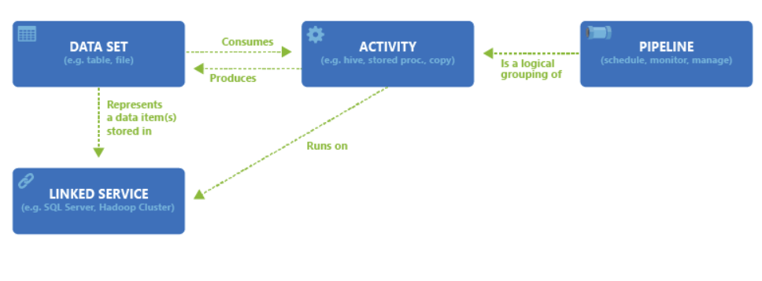
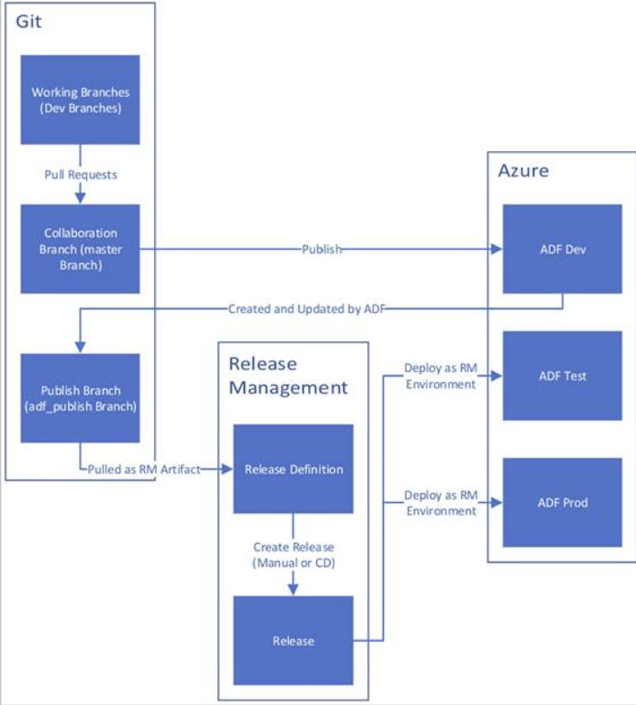

## ***Azure Data Factory***:

* ***Main Concepts***:
    - Pipeline - a logical grouping of activities that performs a unit of work.
    - Activity -  a processing step in a pipeline.
    - Datasets represent data structures within the data stores, which simply point to or reference the data you want to use in your activities as inputs or outputs.
    - Linked services are much like connection strings, which define the connection information that's needed for Data Factory to connect to external resources.
    - Triggers represent the unit of processing that determines when a pipeline execution needs to be kicked off
    - A pipeline run is an instance of the pipeline execution.
    - Parameters are key-value pairs of read-only configuration.
    - Control flow is an orchestration of pipeline activities that includes chaining activities in a sequence, branching, defining parameters at the pipeline level, and passing arguments while invoking the pipeline on-demand or from a trigger.
    - Variables can be used inside of pipelines to store temporary values and can also be used in conjunction with parameters to enable passing values between pipelines, data flows, and other activities.
    - Mapping data flows - Create and manage graphs of data transformation logic that you can use to transform any-sized data.
* The different dependency conditions are: Succeeded, Failed, Skipped, Completed.
 
* Triggers:
    - Schedule trigger: A trigger that invokes a pipeline on a wall-clock schedule.
    - Tumbling window trigger: A trigger that operates on a periodic interval, while also retaining state.
        - Retry capability supported
    - Event-based trigger: A trigger that responds to an event. (storage accout only) 
    - Pipelines and triggers have a many-to-many relationship (except for the tumbling window trigger).
* Integration runtime:
    - Data Factory offers three types of Integration Runtime (IR):
        - Azure
            - Data Flow, Data movement, Activity dispatch in private and public network
            - Azure IR supports connecting to data stores and computes services with public accessible endpoints. Enabling Managed Virtual Network, Azure Integration Runtime supports connecting to data stores using private link service in private network environment.
            - Azure integration runtime provides a fully managed, serverless compute in Azure
        - Self-hosted
            - Data movement, Activity dispatch in private and public network
            - Windows only
        - Azure-SSIS
            - SSIS package execution in private and public network
            - Azure-SSIS IR can be provisioned in either public network or private network. On-premises data access is supported by joining Azure-SSIS IR to a Virtual Network that is connected to your on-premises network.
* CI/CD:
 
* Monitoring:
    - Data Factory stores pipeline-run data for only 45 days.