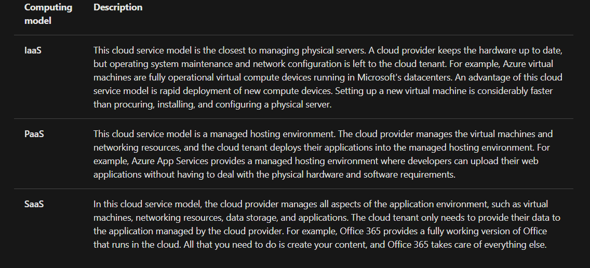
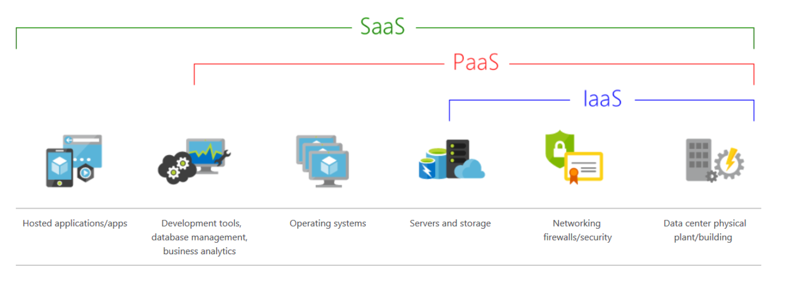
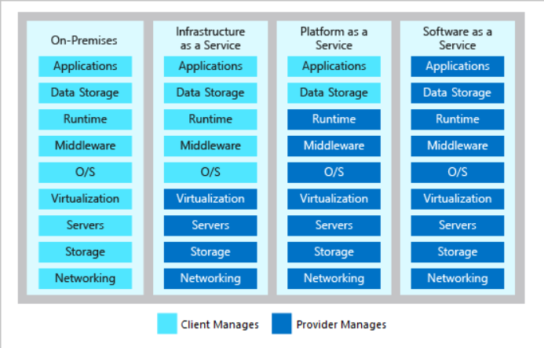
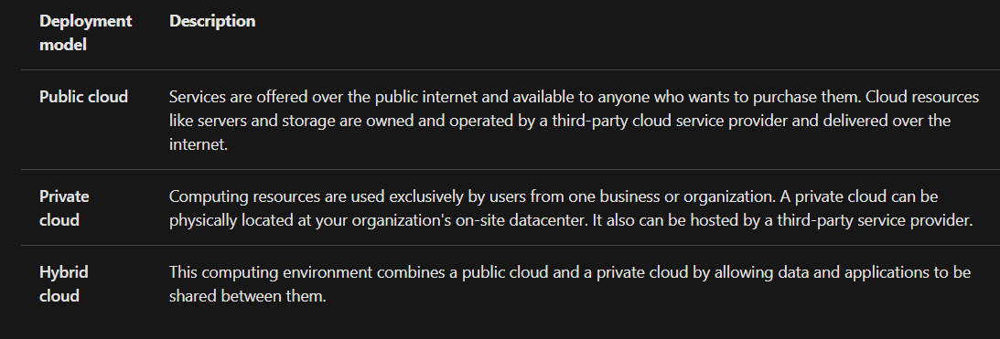
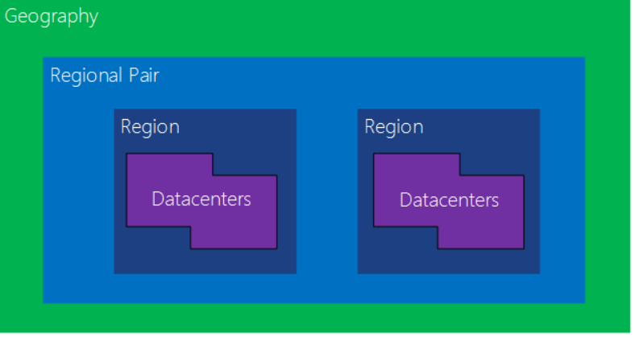
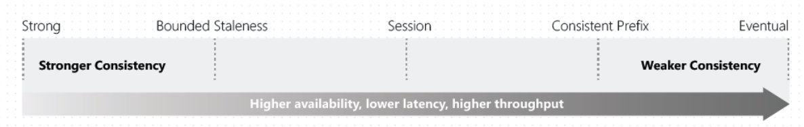
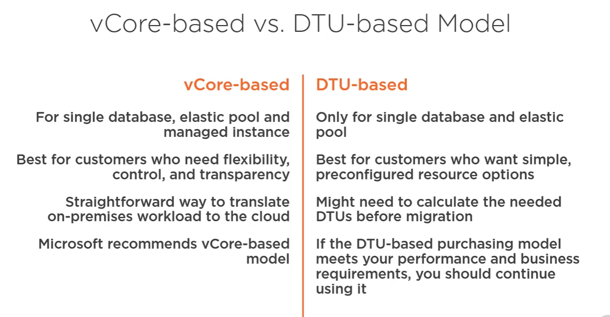
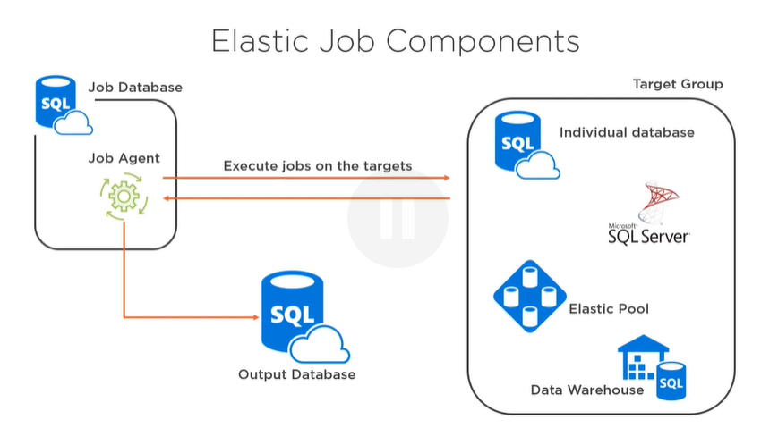
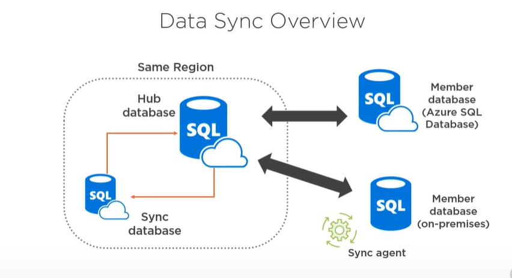

# Describe Cloud Concepts (20-25%)

##  Identiy the benefits and consiferations og using cloud services
The common pricing options for Azure services are:
- Consumption-based price - You are charged for only what you use. This model is also known as the Pay-As-You-Go rate.
- Fixed price - You provision resources and are charged for those instances whether or not they are used.

*High availability:* Depending on the service-level agreement that you choose, your cloud-based applications can provide a continuous user experience with no apparent downtime even when things go wrong.

*Scalability*: Applications in the cloud can be scaled in two ways:
- *Vertically*: Computing capacity can be increased by adding RAM or CPUs to a virtual machine.
- *Horizontally*: Computing capacity can be increased by adding instances of a resource, such as adding more virtual machines to your configuration.

*Elasticity*: Cloud-based applications can be configured to take advantage of autoscaling, so your applications will always have the resources they need.

*Agility*: Cloud-based resources can be deployed and configured quickly as your application requirements change.

*Geo-distribution*: Applications and data can be deployed to regional datacenters around the globe, so your customers always have the best performance in their region.

*Disaster recovery*: By taking advantage of cloud-based backup services, data replication, and geo-distribution, you can deploy your applications with the confidence that comes from knowing that your data is safe in the event that disaster should occur.

## Describe the differences between categories of cloud services

  

  

  

## Describe the differences between types of cloud computing

 

# Describe Core Azure Services (15-20%)

## Describe the core Azure architectural components

A *region* is a set of datacenters deployed within a latency-defined perimeter and connected through a dedicated regional low-latency network. 
 - Government (US)
 - Sovereign

An *Availability Zone* is a high-availability offering that protects your applications and data from datacenter failures. Availability Zones are unique physical locations within an Azure region. Each zone is made up of one or more datacenters equipped with independent power, cooling, and networking. To ensure resiliency, there's a minimum of three separate zones in all enabled regions.

A *regional pair* consists of two regions within the same geography. Azure serializes platform updates (planned maintenance) across regional pairs, ensuring that only one region in each pair updates at a time. If an outage affects multiple regions, at least one region in each pair will be prioritized for recovery.

A *resource group* is a container that holds related resources for an Azure solution.

# DP-200

## Storage Account

* The name must be unique across all existing storage account names in Azure.
* Account kinds:
    - ***General-purpose v2 accounts***: Basic storage account type for blobs, files, queues, and tables. Recommended for most scenarios using Azure Storage. (Blobs (all types: Block, Append, Page), Data Lake Gen2, Files, Disks, Queues, Tables)
    - ***General-purpose v1 accounts***: Legacy account type for blobs, files, queues, and tables. Use general-purpose v2 accounts instead when possible.(Blobs (all types), Files, Disks, Queues, Tables)
    - ***BlockBlobStorage accounts***: Storage accounts with premium performance characteristics for block blobs and append blobs. Recommended for scenarios with high transactions rates, or scenarios that use smaller objects or require consistently low storage latency. BlockBlobStorage accounts don't currently support tiering to hot, cool, or archive access tiers. This type of storage account does not support page blobs, tables, or queues.
    -  ***FileStorage accounts***: Files-only storage accounts with premium performance characteristics. Recommended for enterprise or high performance scale applications. This storage account kind supports files but not block blobs, append blobs, page blobs, tables, or queues. FileStorage accounts offer unique performance dedicated characteristics such as IOPS bursting.
    - ***BlobStorage accounts***: Legacy Blob-only storage accounts. Use general-purpose v2 accounts instead when possible.
* Performance tiers: 
    - ***Standard*** storage accounts are backed by magnetic drives and provide the lowest cost per GB. They're best for applications that require bulk storage or where data is accessed infrequently. 
    - ***Premium*** storage accounts are backed by solid state drives and offer consistent, low-latency performance. They can only be used with Azure virtual machine disks, and are best for I/O-intensive applications, like databases. Additionally, virtual machines that use Premium storage for all disks qualify for a 99.9% SLA, even when running outside of an availability set. This setting can't be changed after the storage account is created.
* Access tiers(https://docs.microsoft.com/en-us/azure/storage/blobs/storage-blob-storage-tiers?tabs=azure-portal):
    - ***Hot*** - Optimized for storing data that is accessed frequently.
    - ***Cool*** - Optimized for storing data that is infrequently accessed and stored for at least 30 days.
    - ***Archive*** - Optimized for storing data that is rarely accessed and stored for at least 180 days with flexible latency requirements (on the order of hours).
    - Only the hot and cool access tiers can be set at the account level. The archive access tier isn't available at the account level.
    - Hot, cool, and archive tiers can be set at the blob level during upload or after upload.
    - Object storage data tiering between hot, cool, and archive is only supported in Blob Storage and General Purpose v2 (GPv2) accounts.  
* Replication: (https://docs.microsoft.com/en-us/azure/storage/common/storage-redundancy)
    - Data in an Azure Storage account is always replicated three times in the *primary region*.
    - Azure Storage offers two options for how your data is replicated in the primary region:
        - ***Locally redundant storage (LRS)***  copies your data synchronously three times within a single physical location in the primary region.
            - server level redundancy
        - ***Zone-redundant storage (ZRS)*** copies your data synchronously across three Azure availability zones in the primary region.
            - availability zones level redundancy
    - Azure Storage offers two options for copying your data to a *secondary region*:
        - ***Geo-redundant storage (GRS)*** copies your data synchronously three times within a single physical location in the primary region using LRS, then it copies your data asynchronously three times using LRS in the secondary region.
            - region level redundancy
        - ***Geo-zone-redundant storage (GZRS)*** copies your data synchronously across three Azure availability zones in the primary region using ZRS, then it copies your data asynchronously three times using LRS in the secondary region.
            - region level redundancy 
        - With GRS or GZRS, the data in the secondary region isn't available for read or write access unless there is a failover to the secondary region. For read access to the secondary region, configure your storage account to use read-access geo-redundant storage (RA-GRS) or read-access geo-zone-redundant storage (RA-GZRS). If the primary region becomes unavailable, you can choose to fail over to the secondary region. After the failover has completed, the secondary region becomes the primary region, and you can again read and write data. Azure Files does not support read-access geo-redundant storage (RA-GRS) and read-access geo-zone-redundant storage (RA-GZRS).
        - Only general-purpose v2 storage accounts support GZRS and RA-GZRS. 
* Data Protection Options:
    - Recovery
    - Point-in-time restore for block blobs:
        - To enable point-in-time restore, you create a management policy for the storage account and specify a retention period. During the retention period, you can restore block blobs from the present state to a state at a previous point in time.
        - Point-in-time restore requires that the following Azure Storage features be enabled before you can enable point-in-time restore: Soft delete, Change feed, Blob versioning
    - Soft Delete for Blobs:
        - Whensoft  delete for blobs is enabled on a storage account, you can recover objects after they have been deleted, within the specified data retention period. This protection extends to any blobs (block blobs, append blobs, or page blobs) that are erased as the result of an overwrite.
    - Soft Delete for Containers(preview)
    - Soft Delete for File Shares
    - Tracking
    - Versioning for Blobs
    - Blob Change Feed:
        The purpose of the change feed is to provide transaction logs of all the changes that occur to the blobs and the blob metadata in your storage account. The change feed provides ordered, guaranteed, durable, immutable, read-only log of these changes
* ***Blob Types***:
    - Azure Storage supports three types of blobs:
        - ***Block blobs*** store text and binary data. Block blobs are made up of blocks of data that can be managed individually. Block blobs store up to about 4.75 TiB of data. Larger block blobs are available in preview, up to about 190.7 TiB
        - ***Append blobs*** are made up of blocks like block blobs, but are optimized for append operations. Append blobs are ideal for scenarios such as logging data from virtual machines.
        - ***Page blobs*** store random access files up to 8 TB in size. Page blobs store virtual hard drive (VHD) files and serve as disks for Azure virtual machines.
* ***Queues***:
    - Azure Queue Storage is a service for storing large numbers of messages. You access messages from anywhere in the world via authenticated calls using HTTP or HTTPS. A queue message can be up to 64 KB in size. A queue may contain millions of messages, up to the total capacity limit of a storage account. Before version 2017-07-29, the maximum time-to-live allowed is seven days. For version 2017-07-29 or later, the maximum time-to-live can be any positive number, or -1 indicating that the message doesn't expire. If this parameter is omitted, the default time-to-live is seven days. 
* ***Tables***:
    - Azure Table storage stores large amounts of structured data. The service is a NoSQL datastore which accepts authenticated calls from inside and outside the Azure cloud. Azure tables are ideal for storing structured, non-relational data. 
    - Entity: An entity is a set of properties, similar to a database row. An entity in Azure Storage can be up to 1MB in size. An entity in Azure Cosmos DB can be up to 2MB in size.
    - Properties: A property is a name-value pair. Each entity can include up to 252 properties to store data. Each entity also has three system properties that specify a partition key, a row key, and a timestamp. Entities with the same partition key can be queried more quickly, and inserted/updated in atomic operations. An entity's row key is its unique identifier within a partition.
* ***File Shares***:
    - Azure Files offers fully managed file shares in the cloud that are accessible via the industry standard Server Message Block (SMB) protocol or Network File System (NFS) protocol. Azure file shares can be mounted concurrently by cloud or on-premises deployments. Azure Files SMB file shares are accessible from Windows, Linux, and macOS clients. Azure Files NFS file shares are accessible from Linux or macOS clients. Additionally, Azure Files SMB file shares can be cached on Windows Servers with Azure File Sync for fast access near where the data is being used.
* ***CORS***:
    - CORS is an HTTP feature that enables a web application running under one domain to access resources in another domain. Web browsers implement a security restriction known as same-origin policy that prevents a web page from calling APIs in a different domain. CORS provides a secure way to allow one domain (the origin domain) to call APIs in another domain.
* ***A shared access signature (SAS)***:
    -  SAS is a URI that grants restricted access rights to Azure Storage resources. You can provide a shared access signature to clients who should not be trusted with your storage account key but to whom you wish to delegate access to certain storage account resources. By distributing a shared access signature URI to these clients, you can grant them access to a resource for a specified period of time, with a specified set of permissions.

* ***Some links***:
    - https://docs.microsoft.com/en-us/azure/storage/blobs/storage-blobs-introduction

## Data Lake Gen2:

* Azure Data Lake - a hyper-scale repository for big data analytic workloads
* ***Key Features***:
    - Hadoop compatible. Manage data same as Hadoop HDFS
    - POSIX permissions. Supports ACL  (POSIX-like file access permissions) (https://docs.microsoft.com/en-us/azure/storage/blobs/data-lake-storage-access-control)
    - Cost effective. Offers low-cost storage capacity
    - Includes enterprise-grade capabilities: security, manageability, scalability, reliability, and availability

* ***Some links***:
    - https://www.bluegranite.com/blog/10-things-to-know-about-azure-data-lake-storage-gen2

## Cosmos DB:

* Cosmos DB - globally distributed, multi-model database service
* ***Benefits of NoSQL concept***:
    - High throughput
    - Hierarchical data (order - order details)
    - Complex networks and relationships
    - Fluid schema
    - Microservices (JSON)
* ***Chalenges with NoSQL***:
    - Transactions with many relations pointing to the same entity
    - Transactions requiring strong consistency across the entire dataset
* ***Main Concepts***:
    - Global destribution and multy-homing
        - hight availability
        - hight responsibility
        - unlimited elastic write and read scalability.
    - Data consistency levels
    - Time-to-Live (TTL)
        - With ***Time to Live*** or TTL, Azure Cosmos DB provides the ability to delete items automatically from a container after a certain time period. 
    - Data Partitioning
  
* ***Consistency levels***(https://docs.microsoft.com/en-us/azure/cosmos-db/consistency-levels):
    - Default - Session
    - Consistent prefix - guantees that reads never see out-of-order writes 
    - ***Strong***:
        - guarantees: Linearizable reads\
          Users are always guaranteed to read the latest committed write.
    - ***Bounded staleness***
        - guarantees: Consistent Prefix. Reads lag behind writes by k prefixes or t interval\
        "staleness" can be configured in two ways:
            - The number of versions (K) of the item
            - The time interval (T) reads might lag behind the writes
        - Inside the staleness window, Bounded Staleness provides the following consistency for clients guarantees:
            - in the same region for an account with single write region = Strong
            - in different regions for an account with single write region = Consistent Prefix
            - writing to a single region for an account with multiple write regions = Consistent Prefix
            - writing to different regions for an account with multiple write regions = Eventual
        - Bounded staleness is frequently chosen by globally distributed applications that expect low write latencies but require total global order guarantee. 
        - Cosmos accounts configured with multiple write regions cannot be configured for strong consistency
    - ***Session***
        - guarantees: Consistent Prefix. Monotonic reads, monotonic writes, read-your-writes, write-follows-reads\
          Within a single client session reads are guaranteed to honor the consistent-prefix, monotonic reads, monotonic writes, read-your-writes, and write-follows-reads guarantees. This assumes a single "writer" session or sharing the session token for multiple writers.
        - Clients outside of the session performing writes will see the following consistency for clients guarantees:
            - in same region for an account with single write region = Consistent Prefix
            - in different regions for an account with single write region = Consistent Prefix
            - writing to a single region for an account with multiple write regions = Consistent Prefix
            - clients writing to multiple regions for a account with multiple write regions = Eventual
        - Session consistency is the most widely used consistency level for both single region as well as globally distributed applications. It provides write latencies, availability, and read throughput comparable to that of eventual consistency but also provides the consistency guarantees that suit the needs of applications written to operate in the context of a user. 
    - ***Consistent prefix***
        - guarantees:  Updates returned are some prefix of all the updates, with no gaps\
          Updates that are returned contain some prefix of all the updates, with no gaps. Consistent prefix consistency level guarantees that reads never see out-of-order writes.
        - Below are the consistency guarantees for Consistent Prefix:
            - in same region for an account with single write region = Consistent Prefix
            - in different regions for an account with single write region = Consistent Prefix
            - writing to a single region for an account with multiple write region = Consistent Prefix
            - writing to multiple regions for an account with multiple write region = Eventual
    - ***Eventual***
        - guarantees:  Eventual\
          There's no ordering guarantee for reads. In the absence of any further writes, the replicas eventually converge.
    - ? Read consistency applies to a single read operation scoped within a logical partition. The read operation can be issued by a remote client or a stored procedure.

* ***Hight Availability***:
    - Replicates data across regions configured within a Cosmos account
    - Maintains 4 replicas of data within a region
    - The data within Azure Cosmos containers is horizontally partitioned.
    - A partition-set is a collection of multiple replica-sets. 
    - Each partition across all the regions is replicated. 
    - You can enable zone redundancy when selecting a region to associate with your Azure Cosmos database.
* ***Conflicts***:
    - Insert conflicts: These conflicts can occur when an application simultaneously inserts two or more items with the same unique index in two or more regions. For example, this conflict might occur with an ID property.
    - Replace conflicts: These conflicts can occur when an application updates the same item simultaneously in two or more regions.
    - Delete conflicts: These conflicts can occur when an application simultaneously deletes an item in one region and updates it in another region.
    - Conflict resolution policies:
        - Last Write Wins (LWW): This resolution policy, by default, uses a system-defined timestamp property. 
        - Custom: This resolution policy is designed for application-defined semantics for reconciliation of conflicts.
* ***Partitioning***
    - Azure Cosmos DB uses partitioning to scale individual containers in a database to meet the performance needs of your application
    - ***A logical partition*** consists of a set of items that have the same partition key. Each logical partition can store up to 20GB of data. Good partition key choices have a wide range of possible values.
    - A container is scaled by distributing data and throughput across ***physical partitions***. Internally, one or more logical partitions are mapped to a single physical partition.
    - The number of physical partitions in your container depends on the following configuration:
        - The number of throughput provisioned (each individual physical partition can provide a throughput of up to 10,000 request units per second).
        - The total data storage (each individual physical partition can store up to 50GB data).
    - Each physical partition consists of a set of replicas, also referred to as a replica set.
    - Typically smaller containers only require a single physical partition but they will still have at least 4 replicas
    - A partition key has two components: partition key path and the partition key value. 
    - For all containers, your partition key should:
        - Be a property that has a value which does not change. If a property is your partition key, you can't update that property's value.
        - Have a high cardinality. In other words, the property should have a wide range of possible values.
        - Spread request unit (RU) consumption and data storage evenly across all logical partitions. This ensures even RU consumption and storage distribution across your physical partitions.
    - If you need multi-item ACID transactions in Azure Cosmos DB, you will need to use stored procedures or triggers. All JavaScript-based stored procedures and triggers are scoped to a single logical partition.
    - You can't run stored procedures or triggers across multiple logical partitions.
* ***Capacity***:
    - ***Request unit*** is a performance currency abstracting the system resources such as CPU, IOPS, and memory that are required to perform the database operations supported by Azure Cosmos DB.
    - The cost to do a point read (i.e. fetching a single item by its ID and partition key value) for a 1 KB item is 1 RU.
    - There are 3 modes in which you can create an account:
        - ***Provisioned throughput mode***: In this mode, you provision the number of RUs for your application on a per-second basis in increments of 100 RUs per second. You can provision throughput at two distinct granularities: containers, databases
        - ***Serverless mode***: In this mode, you don't have to provision any throughput when creating resources in your Azure Cosmos account. At the end of your billing period, you get billed for the amount of Request Units that has been consumed by your database operations.
        - ***Autoscale mode***: In this mode, you can automatically and instantly scale the throughput (RU/s) of your database or container based on it's usage
    - Assuming that a Cosmos container is configured with 'R' RUs and there are 'N' regions associated with the Cosmos account, the total RUs available globally on the container = R x N. You can't selectively assign RUs to a specific region.
*  Your data is now encrypted in transit (over the network) and at rest (nonvolatile storage), giving you end-to-end encryption.
* The Azure Cosmos DB change feed enables efficient processing of large datasets with a high volume of writes. Change feed also offers an alternative to querying an entire dataset to identify what has changed. This document focuses on common change feed design patterns, design tradeoffs, and change feed limitations.
* ***APIs***:
    - ***SQL/Core API*** (collection):
        - SQL like Select
        - 3 types of indexes:
            - Range index is based on an ordered tree-like structure. 
            - Range indexes can be used on scalar values (string or number).
            - Spatial indices enable efficient queries on geospatial objects such as - points, lines, polygons, and multipolygon. These queries use ST_DISTANCE, ST_WITHIN, ST_INTERSECTS keywords. 
            - Spatial indexes can be used on correctly formatted GeoJSON objects. Points, LineStrings, Polygons, and MultiPolygons are currently supported.
            - Composite indices increase the efficiency when you are performing operations on multiple fields.
        - Change feed:
            - The change feed does not capture deletes. If you delete an item from your container, it is also removed from the change feed. 
            - Change feed functionality is surfaced as change streams in MongoDB API and Query with predicate in Cassandra API.   
    - ***Table API*** (table):
    - ***MongoDB API*** (collection):
    - ***Cassandra API*** (table):
        - Wide column store (unlike a relational dbs, the and format of the columns van vary from row to row in the same table)
        - CQL
    - ***Gremlin API*** (graph):

* ***Some links***:
    - https://docs.microsoft.com/en-us/azure/cosmos-db/global-dist-under-the-hood

## Azure SQL Database

* ***Resource purchasing models***:
    - ***DTU*** (Database transaction unit):
        - guarantees a certain level of compute, storage, and I/O resources
    - ***VCore*** (recomended):
        - gives the option to choose between generations of hardware, number of cores, memory, and storage size 

* ***Service tiers***:
    - ***Standart (General purpose)*** - is disigned for most generic workloads, 99.99% SLA, 5-10ms storage latency
    - ***Premium (Business critical)*** - for apps requiring low latency, 99.99% SLA, 1-2ms storage latency 
    - ***Hyperscale*** - is primarily intended for customers who have large dbs, up to 100TB (vcore only)
* ***Deployment options***:
    - ***Single database*** - isolated db that is perfect for applications that need a single data source
        - Each db with its own guaranteed compute, memory, and storage
        - Each db is isolated from each other and is managed via a SQL Database server (logical server)
    - ***Elastic pool*** - collection of single dbs with a shared set of resources such as CPU or memory 
        - Cost-effective solution for managing and scaling multiple dbs that have varying and iunpredictable usage demands
        - The dbs are on a single Azure SQL Db server and share a set number of resources at a set price
        - Prevent over-provisioning or under-provisioning of resources
    - ***Managed instance*** - a set of dbs that can be used together, easy migration of on-premises dbs
        - Providing a native vitual network implementation
        - Near 100% compativility with the latest SQL Server on-prem
        - Each instance has its guaranteed resources
        - SSIS support via ADF or Azure Database Migration Service
        - Migration Options:
            - Back up and restore:
                - Backups stored in Azure blob can be restore into a managed instance using the T-SQL RESTORE command
            - Data Migration Service:
                - A fully managed service enavling easy migration from SQL Server dbs tp Azure Data platform
        - Single-tenant env with dedicated underlying infrastructure
        - TLS 1.2
* ***Security***:
    - ***Network security***:
        - ***IP firewall rules***:
            - Grand access to dbs based on the originating IP address of each request
        - ***VNet firewall rules***:
            - Enable azure sql db to only accept requests originated from subnets inside a vNet
        - ***Private Endpoints***
    - ***Access management***:
        - ***SQL authentication***:
            - Using DB username and password
        - ***Azure AD authentication***:
            - Using identities in AAD
        - ***Row-level security***:
            - Control access to rows ib a table based on the role of the user
    - ***Threat protection***:
        - ***Auditing in Azure Monitor logs and Event Hubs***:
            - Tracking db activities and helps maintaining compliance with security standards
        - ***Advanced Thread Protection***:
            - Analyzes your SQL Server logs to detect unusual behavior and potentially harmful attemps
    - ***Information protection and encryption***:
        - ***Transport Layer Security (TLS)***:
            - Always enforces encryption for all connections
        - ***Transparent Data Encryption***:
            - Protects data at rest from offline access to raw files or backups
        - ***Dynamic data masking***:
            - Protects sensitive data by masking it for non-privileged users
        - ***Always Encrypted***:
            - Protects data from high privileged, unauthorized users
        -*** Key management***:
            Allows customers to take ownership of key management using AKV
* ***Backups***:
    - Azure SQL DB automatically creates the db backups that kept between 7 and 35 days
    - Types:
        - Full backup:
            - Backs up the whole db
            - Every weel
        - Differential backup:
            - Captures only the data that has changed since the last full backup 
            - every 12 hours
        - Transaction log backup:
            - Records of all the committed and uncommitted trans
            - every 5-10 minutes
    - Backup files are copied to RA-GRS Standard blob storage by default
    - Backups are automatically encrypred at rest via TDE
    - Retention Periond Types:
        - Point in time (7-35 days)
        - Long-term retention (up to 10 years)
            - only full backups
    - Restore options:
        - Restore an existing db to a point-in-time in the past
        - Restore a deleted db to the time it was deleted
        - Restore a db to another geo location
        - Resore a db from a specific long-term backup
    - After deleting a logical server dbs could not be restored (you can just use long term backups)
* ***Elastic DB Job***:
    - Is a native Azure SQL DB service that executes custom jobs on onr pr many Azure SQL DBs in an interval
    - Targets different SQL DB servers, subs, and regions
    - Supports T-SQL or Powershell creation
    - Provide the ability to run one or more T-SQL scripts in parallel, across many dbs, on a schedule or on-demand
    - Single and pooled dbs, SQL Server and shardmap are supported
    - Servers and pools are enumerated at runtime, so jobs run against dbs that exists at the time of execution 

* ***SQL Data Sync***:

    - Is an Azure SQL db service that lets you synchronize the data bi-directionally across multiple SQL dbs and SQL Servers instances
    - Main Cases:
        - Hybrid data sync
        - Distribured apps
        - Globally distributed apps