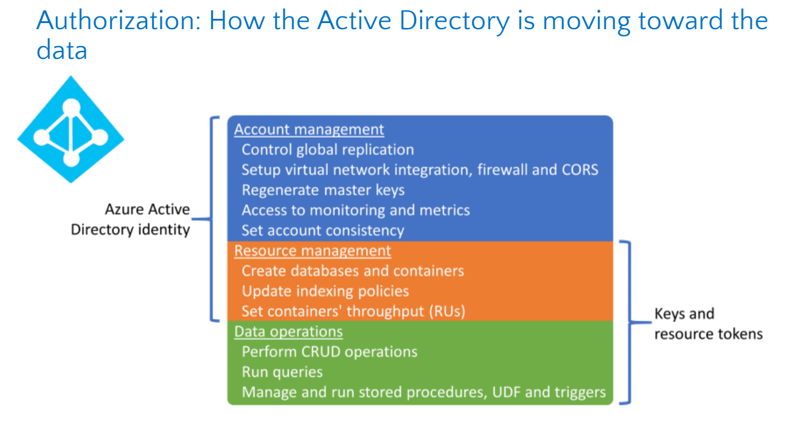

## ***Cosmos DB***

* Cosmos DB - globally distributed, multi-model database service
* ***Benefits of NoSQL concept***:
    - High throughput
    - Hierarchical data (order - order details)
    - Complex networks and relationships
    - Fluid schema
    - Microservices (JSON)
* ***Chalenges with NoSQL***:
    - Transactions with many relations pointing to the same entity
    - Transactions requiring strong consistency across the entire dataset
* ***Main Concepts***:
    - Global destribution and multy-homing
        - hight availability
        - hight responsibility
        - unlimited elastic write and read scalability.
    - Data consistency levels
    - Time-to-Live (TTL)
        - With ***Time to Live*** or TTL, Azure Cosmos DB provides the ability to delete items automatically from a container after a certain time period. 
    - Data Partitioning
  
* ***Consistency levels***(https://docs.microsoft.com/en-us/azure/cosmos-db/consistency-levels):
    - Default - Session
    - Consistent prefix - guantees that reads never see out-of-order writes 
    - ***Strong***:
        - guarantees: Linearizable reads\
          Users are always guaranteed to read the latest committed write.
        - not available in multi-write accounts
    - ***Bounded staleness***
        - guarantees: Consistent Prefix. Reads lag behind writes by k prefixes or t interval\
        "staleness" can be configured in two ways:
            - The number of versions (K) of the item
            - The time interval (T) reads might lag behind the writes
        - Inside the staleness window, Bounded Staleness provides the following consistency for clients guarantees:
            - in the same region for an account with single write region = Strong
            - in different regions for an account with single write region = Consistent Prefix
            - writing to a single region for an account with multiple write regions = Consistent Prefix
            - writing to different regions for an account with multiple write regions = Eventual
        - Bounded staleness is frequently chosen by globally distributed applications that expect low write latencies but require total global order guarantee. 
        - Cosmos accounts configured with multiple write regions cannot be configured for strong consistency
    - ***Session***
        - guarantees: Consistent Prefix. Monotonic reads, monotonic writes, read-your-writes, write-follows-reads\
          Within a single client session reads are guaranteed to honor the consistent-prefix, monotonic reads, monotonic writes, read-your-writes, and write-follows-reads guarantees. This assumes a single "writer" session or sharing the session token for multiple writers.
        - Clients outside of the session performing writes will see the following consistency for clients guarantees:
            - in same region for an account with single write region = Consistent Prefix
            - in different regions for an account with single write region = Consistent Prefix
            - writing to a single region for an account with multiple write regions = Consistent Prefix
            - clients writing to multiple regions for a account with multiple write regions = Eventual
        - Session consistency is the most widely used consistency level for both single region as well as globally distributed applications. It provides write latencies, availability, and read throughput comparable to that of eventual consistency but also provides the consistency guarantees that suit the needs of applications written to operate in the context of a user. 
    - ***Consistent prefix***
        - guarantees:  Updates returned are some prefix of all the updates, with no gaps\
          Updates that are returned contain some prefix of all the updates, with no gaps. Consistent prefix consistency level guarantees that reads never see out-of-order writes.
        - Below are the consistency guarantees for Consistent Prefix:
            - in same region for an account with single write region = Consistent Prefix
            - in different regions for an account with single write region = Consistent Prefix
            - writing to a single region for an account with multiple write region = Consistent Prefix
            - writing to multiple regions for an account with multiple write region = Eventual
    - ***Eventual***
        - guarantees:  Eventual\
          There's no ordering guarantee for reads. In the absence of any further writes, the replicas eventually converge.
    - ? Read consistency applies to a single read operation scoped within a logical partition. The read operation can be issued by a remote client or a stored procedure.

* ***Hight Availability***:
    - Replicates data across regions configured within a Cosmos account
    - Maintains 4 replicas of data within a region
    - The data within Azure Cosmos containers is horizontally partitioned.
    - A partition-set is a collection of multiple replica-sets. 
    - Each partition across all the regions is replicated. 
    - You can enable zone redundancy when selecting a region to associate with your Azure Cosmos database.
* ***Conflicts***:
    - Insert conflicts: These conflicts can occur when an application simultaneously inserts two or more items with the same unique index in two or more regions. For example, this conflict might occur with an ID property.
    - Replace conflicts: These conflicts can occur when an application updates the same item simultaneously in two or more regions.
    - Delete conflicts: These conflicts can occur when an application simultaneously deletes an item in one region and updates it in another region.
    - Conflict resolution policies:
        - Last Write Wins (LWW): This resolution policy, by default, uses a system-defined timestamp property. 
        - Custom: This resolution policy is designed for application-defined semantics for reconciliation of conflicts.
* ***Partitioning***
    - Azure Cosmos DB uses partitioning to scale individual containers in a database to meet the performance needs of your application
    - ***A logical partition*** consists of a set of items that have the same partition key. Each logical partition can store up to 20GB of data. Good partition key choices have a wide range of possible values.
    - A container is scaled by distributing data and throughput across ***physical partitions***. Internally, one or more logical partitions are mapped to a single physical partition.
    - The number of physical partitions in your container depends on the following configuration:
        - The number of throughput provisioned (each individual physical partition can provide a throughput of up to 10,000 request units per second).
        - The total data storage (each individual physical partition can store up to 50GB data).
    - Each physical partition consists of a set of replicas, also referred to as a replica set.
    - Typically smaller containers only require a single physical partition but they will still have at least 4 replicas
    - A partition key has two components: partition key path and the partition key value. 
    - For all containers, your partition key should:
        - Be a property that has a value which does not change. If a property is your partition key, you can't update that property's value.
        - Have a high cardinality. In other words, the property should have a wide range of possible values.
        - Spread request unit (RU) consumption and data storage evenly across all logical partitions. This ensures even RU consumption and storage distribution across your physical partitions.
    - If you need multi-item ACID transactions in Azure Cosmos DB, you will need to use stored procedures or triggers. All JavaScript-based stored procedures and triggers are scoped to a single logical partition.
    - You can't run stored procedures or triggers across multiple logical partitions.
* ***Capacity***:
    - ***Request unit*** is a performance currency abstracting the system resources such as CPU, IOPS, and memory that are required to perform the database operations supported by Azure Cosmos DB.
    - The cost to do a point read (i.e. fetching a single item by its ID and partition key value) for a 1 KB item is 1 RU.
    - There are 3 modes in which you can create an account:
        - ***Provisioned throughput mode***: In this mode, you provision the number of RUs for your application on a per-second basis in increments of 100 RUs per second. You can provision throughput at two distinct granularities: containers, databases
            - You can optionally provision dedicated throughput for a container within a database that has throughput provisioned. This dedicated throughput amount will not be shared with other containers in the database and does not count towards the throughput you provisioned for the database. This throughput amount will be billed in addition to the throughput amount you provisioned at the database level.
        - ***Serverless mode***: In this mode, you don't have to provision any throughput when creating resources in your Azure Cosmos account. At the end of your billing period, you get billed for the amount of Request Units that has been consumed by your database operations.
        - ***Autoscale mode***: In this mode, you can automatically and instantly scale the throughput (RU/s) of your database or container based on it's usage
    - Assuming that a Cosmos container is configured with 'R' RUs and there are 'N' regions associated with the Cosmos account, the total RUs available globally on the container = R x N. You can't selectively assign RUs to a specific region.
*  Your data is now encrypted in transit (over the network) and at rest (nonvolatile storage), giving you end-to-end encryption.
* The Azure Cosmos DB change feed enables efficient processing of large datasets with a high volume of writes. Change feed also offers an alternative to querying an entire dataset to identify what has changed. This document focuses on common change feed design patterns, design tradeoffs, and change feed limitations.
* ***APIs***:
    - ***SQL/Core API*** (collection):
        - SQL like Select
        - 3 types of indexes:
            - Range index is based on an ordered tree-like structure. 
            - Range indexes can be used on scalar values (string or number).
            - Spatial indices enable efficient queries on geospatial objects such as - points, lines, polygons, and multipolygon. These queries use ST_DISTANCE, ST_WITHIN, ST_INTERSECTS keywords. 
            - Spatial indexes can be used on correctly formatted GeoJSON objects. Points, LineStrings, Polygons, and MultiPolygons are currently supported.
            - Composite indices increase the efficiency when you are performing operations on multiple fields.
        - Change feed:
            - The change feed does not capture deletes. If you delete an item from your container, it is also removed from the change feed. 
            - Change feed functionality is surfaced as change streams in MongoDB API and Query with predicate in Cassandra API.   
    - ***Table API*** (table):
    - ***MongoDB API*** (collection):
    - ***Cassandra API*** (table):
        - Wide column store (unlike a relational dbs, the and format of the columns van vary from row to row in the same table)
        - CQL
    - ***Gremlin API*** (graph):
* ***Indexes***:
    - In Azure Cosmos DB, every container has an indexing policy that dictates how the container's items should be indexed. The default indexing policy for newly created containers indexes every property of every item and enforces range indexes for any string or number. 

    - The three indexing modes you can use with Azure Cosmos DB are:
        - Consistent: The index is updated synchronously every time a new document is written to the collection. New queries on the collection use the updated index right away. Query results are consistent with the updated documents in the collection.
        - Lazy: The index is updated at a lower priority. The reads and writes from the collection take a higher priority. In lazy mode, writes are cheaper because the index isn't updated immediately. When the index is fully updated depends on the demands on the collection. Query results don't include the updated documents until the index is consistent with the collection.
            - New containers cannot select lazy indexing. You can request an exemption by contacting Azure support (except if you are using an Azure Cosmos account in serverless mode which doesn't support lazy indexing).
        - None: No index is created. Queries are expensive on collections that aren't indexed. If you're using your Azure Cosmos DB collection to read records directly rather than querying the collection, it's possible to avoid the overhead of indexing.It can also be used to improve the performance of bulk operations. After the bulk operations are complete, the index mode can be set to Consistent and then monitored using the IndexTransformationProgress until complete.
    - Spatial indexes
        - Spatial indices enable efficient queries on geospatial objects such as - points, lines, polygons, and multipolygon. These queries use ST_DISTANCE, ST_WITHIN, ST_INTERSECTS keywords. The following are some examples that use spatial index typr
    - Composite indexes
        - Queries that have an ORDER BY clause with two or more properties require a composite index. You can also define a composite index to improve the performance of many equality and range queries. By default, no composite indexes are defined so you should add composite indexes as needed.
    - Range Indexes
        - Range index is based on an ordered tree-like structure. The range index type is used for:
            - Equality queries
            - Equality match on an array element
            - Range queries
            - Checking for the presence of a property
            - String system functions
            - ORDER BY queries
            - JOIN queries
        - Range indexes can be used on scalar values (string or number). The default indexing policy for newly created containers enforces range indexes for any string or number.
    - it is not possible to activate TTL on a container where the indexing mode is set to none,
    - it is not possible to set the indexing mode to None on a container where TTL is activated.

* There are three conflict resolution modes offered by Azure Cosmos DB.
    - Last-Writer-Wins (LWW), in which conflicts are resolved based on the value of a user-defined integer property in the document. By default _ts is used to determine the last written document. Last-Writer-Wins is the default conflict handling mechanism.
    - Custom - User-defined function, in which you can fully control conflict resolution by registering a User-defined function to the collection. A User-defined function is a special type of stored procedure with a specific signature. If the User-defined function fails or does not exist, Azure Cosmos DB will add all conflicts into the read-only conflicts feed they can be processed asynchronously.
    - dCustom - Async, in which Azure Cosmos DB excludes all conflicts from being committed and registers them in the read-only conflicts feed for deferred resolution by the user’s application. The application can perform conflict resolution asynchronously and use any logic or refer to any external source, application, or service to resolve the conflict.
* ***Backup***:
    - Completely automated
    - Backups takem every 4 hours
    - 2 backups are stored
    - No configuration possible
    - Backups replicated to paired region
    - A ticket is raised to restore data
    - Custom data backups solutions can be implemented via ADF or via the Cosmos DB change feed
    - When an account is deleted a backup is taken and stored for up to 90 days
    - 
* ***Geo-Replication***:
    - Within a region the data within a container is durably committed by a majority of replica members within the replica set
    - Additional regions can be added as read or read-write depending on the account configuration
    - For single-write account automatic failover can be configured
    - Apps use a ConnectionPolicy to direct preferred write location for multi-write accounts

* ***Server-Side programming***
    - Stored Procedures
        - JavaScript
        - Atomic Transactions
        - Much like with traditional JavaScript applications, you can use console.log() to capture various telemetry and data points for your running code.
    - User-Defined Functions
        - User-defined functions (UDFs) are used to extend the Azure Cosmos DB SQL API’s query language grammar and implement custom business logic. UDFs can only be called from inside queries
        - They do not have access to the context object and are meant to be used as compute-only code

* ***Network Security***:
    - HTTPS/SSL/TLS 1.2 
    - Firewall
    - Private Link

* ***Authorization***:
    - AAD identity 
        - Roles:
            - Azure Owner – All Access
            - Azure Contributor – All Access but no permission to add/remove other AAD principals.
            - Azure Reader – Access to account information.  No data access.
            - Azure Cosmos DB Account Reader – Read access to all account information and read access to data.
    - Master Key
        - Master key - a security token to access all resources for an account. Individuals with the key have full access including read and write access to the all resources in the database account. 
        - Each account consists of 2 Master keys: Primary key and Secondary key
    - Read-only key
        - Each account consists of 2 Read-only keys:
    - Resource token
        - TODO
    - RBAC for data layer in preview
    -  

* ***Synapce Link (Analytical Store)***:
    - 

* ***Some links***:
    - https://docs.microsoft.com/en-us/azure/cosmos-db/global-dist-under-the-hood

