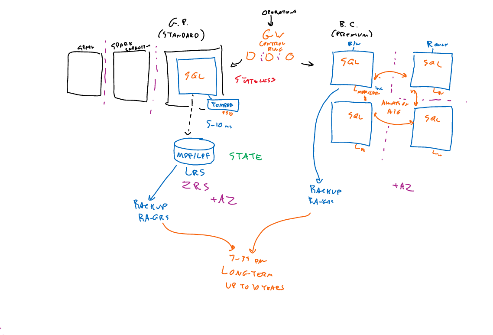

* Types of Data Structure
    - Relational
    - Non-reletional (No-SQL)
        - Document, self-describing like JSON, XML, YARM
        - Key-Value
        - Columnar  
        - Graph

- BIG IDEA - dynamic scalability

* SQL Server
    * SQL Virual Machines
    * Azure Managed Instance (Paas)
        - Vcores
        - VNET integration
        - Dedicated cluster (fully isolated)
        - Tiers:
            - General Purpose
                -  storage is separated from compute 
            - Business critical (Always-On availability groups)
            - 
        - 100% compatability with on-prem server
    * SQL MI Pool
        - precreated resource
        - shared resources
    * SQL Server
        - Logical Container 
    * SQL Database
        - Single database
            - Provisioned resources
            - DTU (linear scale of storage and CPU) /vCore
            - Serverless (vCore + G.P.)
                - Autoscale 
                - Autopause
                - Per-seconds billing
        - Tiers (DTU/vCore)
            - Standard/General Purpose
            - Premium/Business Critical
        - Elastic Pool
    * HyperScale
        - Compute
            -  can have 1 read/write node and up to 4 read replicas
            - no geo-replication
        - Storage
            - can be scaled out    
            - round-robin data writing
 
* Other Databases
    - Single
        - MySQL
        - PostgreSQL
        - MariaDB
    - Flaxible
        - MySQL
        - PostgreSQl
    - HyperScale ? 
        - Postgres

* CosmosDB
    - Build for global distribution

*  Encryption
    - TDE
    - always encripted
    - data masking
    - TLS 
