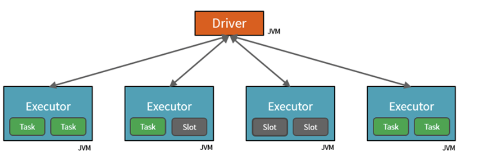
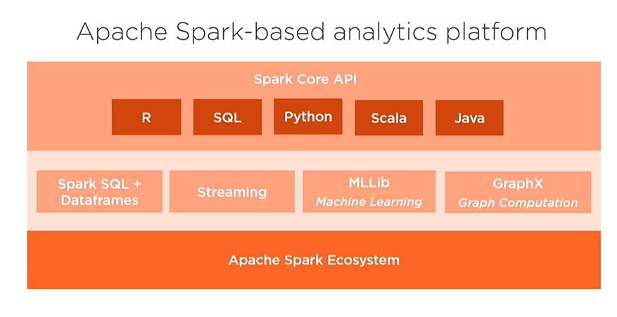
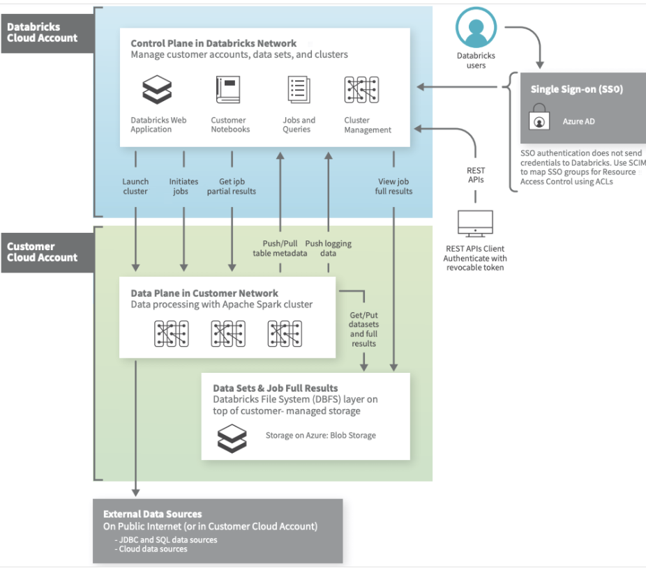

## Databricks

* Native integrative scalable analytics platform based on Apache Spark that provides workflows and workspaces for data users.
* ***High-level architecture***:
    - Apache Spark clusters are groups of computers that are treated as a single computer and handle the execution of commands issued from notebooks. Using a master-worker type architecture, clusters allow processing of data to be parallelized across many computers to improve scale and performance. They consist of a Spark Driver (master) and worker nodes. The driver node sends work to the worker nodes and instructs them to pull data from a specified data source.
    - The "Databricks appliance" is deployed into Azure as a managed resource group within your subscription. This resource group contains the Driver and Worker VMs, along with other required resources, including a virtual network, a security group, and a storage account. All metadata for your cluster, such as scheduled jobs, is stored in an Azure Database with geo-replication for fault tolerance.

* Fundamental Components:
    - ***Workspaces*** 
        - Evn for accessing all databricks assets
        - 3 special folders
            - Workspace
            - Shared 
            - Users 
    - ***Clusters***
        - Unified cluster computing platform
        - Intecative or job
    - ***Notebooks***
        - A web-based interface to documents that contain runnable commands, visualizations, and narrative text.
    - ***Tables***
        - Collection of structured data
        - Equivalent to Apache Spark DataFrame
        - Can be cached, filtered, queried, and more
        - Temporary storage during transformation 
    - ***Jobs***
        - Run workflows intractively per scheduled
* ***Data Management***:
    - ***Databricks File System (DBFS)***:
        - A filesystem abstraction layer over a blob store
        - Databricks File System (DBFS) is a distributed file system mounted into an Azure Databricks workspace and available on Azure Databricks clusters.
        - Benefits:
            - Allows you to mount storage objects so that you can seamlessly access data without requiring credentials.
            - Allows you to interact with object storage using directory and file semantics instead of storage URLs.
            - Persists files to object storage, so you won’t lose data after you terminate a cluster.
        - Mounting object storage to DBFS allows you to access objects in object storage as if they were on the local file system.  
    - ***Tables***:
        - An Azure Databricks database is a collection of tables. An Azure Databricks table is a collection of structured data.
        - A global table is available across all clusters. Azure Databricks registers global tables either to the Azure Databricks Hive metastore or to an external Hive metastore.
        - A local table is not accessible from other clusters and is not registered in the Hive metastore. This is also known as a temporary view.
        - Spark SQL is able to generate partitions dynamically at the file storage level to provide partition columns for tables.
    * ***Metastore***: 
        - The component that stores all the structure information of the various tables and partitions in the data warehouse including column and column type information, the serializers and deserializers necessary to read and write data, and the corresponding files where the data is stored. 
        - Every Azure Databricks deployment has a central Hive metastore accessible by all clusters to persist table metadata
* ***Computation management***:
    - ***Cluster*** - A set of computation resources and configurations on which you run notebooks and jobs. There are two types of clusters: all-purpose and job.
        - You create an all-purpose cluster using the UI, CLI, or REST API. You can manually terminate and restart an all-purpose cluster. Multiple users can share such clusters to do collaborative interactive analysis.
        - The Azure Databricks job scheduler creates a job cluster when you run a job on a new job cluster and terminates the cluster when the job is complete. You cannot restart an job cluster. 
    - ***Pool*** - A set of idle, ready-to-use instances that reduce cluster start and auto-scaling times. When attached to a pool, a cluster allocates its driver and worker nodes from the pool. If the pool does not have sufficient idle resources to accommodate the cluster’s request, the pool expands by allocating new instances from the instance provider. When an attached cluster is terminated, the instances it used are returned to the pool and can be reused by a different cluster.
    - ***Databricks runtime*** - The set of core components that run on the clusters managed by Azure Databricks. Azure Databricks offers several types of runtimes
    - ***Job*** - A non-interactive mechanism for running a notebook or library either immediately or on a scheduled basis. 
    - ***Workload***:
        - Azure Databricks identifies two types of workloads subject to different pricing schemes: data engineering (job) and data analytics (all-purpose).
            - Data engineering An (automated) workload runs on a job cluster which the Azure Databricks job scheduler creates for each workload.
            - Data analytics An (interactive) workload runs on an all-purpose cluster. Interactive workloads typically run commands within an Azure Databricks notebook. However, running a job on an existing all-purpose cluster is also treated as an interactive workload.
* ***Authentication and authorization***:
    - ***User*** - A unique individual who has access to the system.
    - ***Group*** - A collection of users.
    - ***Access control list (ACL)*** - A list of permissions attached to the Workspace, cluster, job, table, or experiment. An ACL specifies which users or system processes are granted access to the objects, as well as what operations are allowed on the assets. Each entry in a typical ACL specifies a subject and an operation.
        - An admin can manage access to Azure Databricks REST APIs by giving or denying users the ability to generate access tokens.   
        - Table, cluster, pool, job, and workspace access control are available only in the Azure Databricks Premium Plan.
* ***Cluster mode***:
    - Standard (Default)
        - Standard clusters are recommended for a single user. Standard clusters can run workloads developed in any language: Python, R, Scala, and SQL.
    - High Concurrency 
        - A High Concurrency cluster is a managed cloud resource. The key benefits of High Concurrency clusters are that they provide Apache Spark-native fine-grained sharing for maximum resource utilization and minimum query latencies.
        - High Concurrency clusters work only for SQL, Python, and R. The performance and security of High Concurrency clusters is provided by running user code in separate processes, which is not possible in Scala.
        - only High Concurrency clusters support table access control.
    - Single Node
        - A Single Node cluster has no workers and runs Spark jobs on the driver node. In contrast, Standard mode clusters require at least one Spark worker node in addition to the driver node to execute Spark jobs.

* ***Some links***:
    - https://github.com/Azure/AzureDatabricksBestPractices/blob/master/toc.md#Deploying-Applications-on-ADB-Guidelines-for-Selecting-Sizing-and-Optimizing-Clusters-Performance