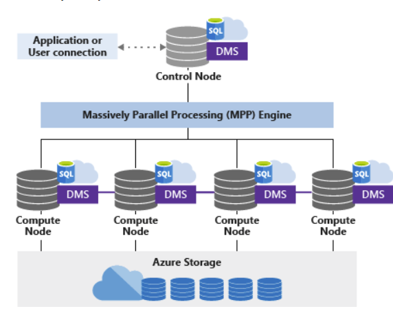
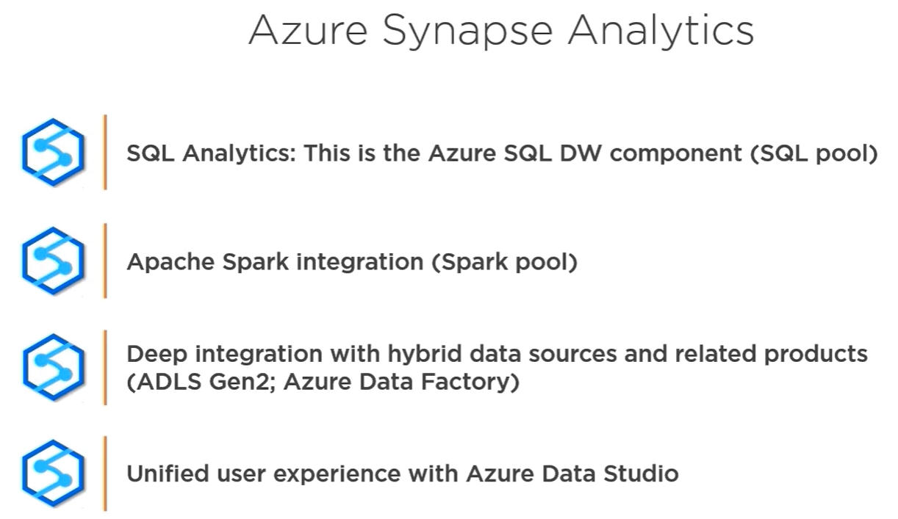
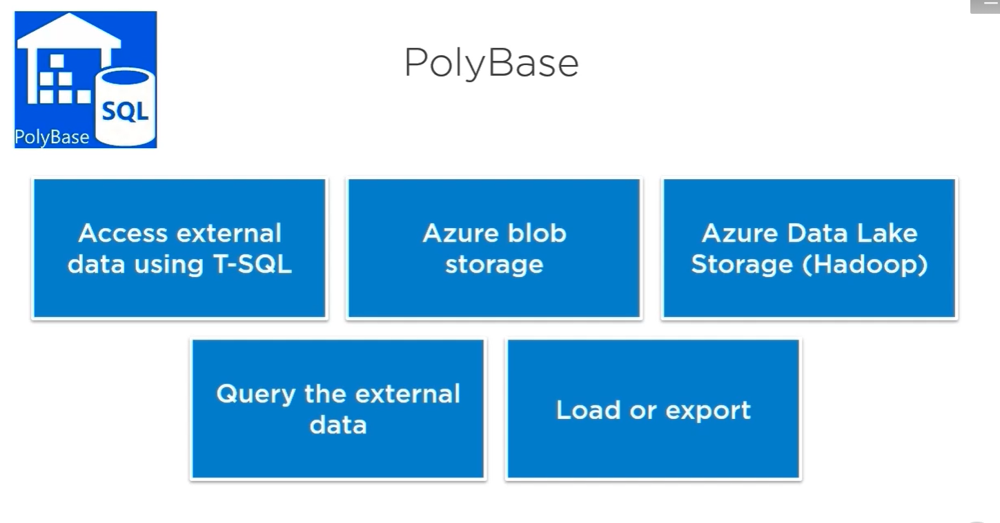

## ***Azure Synapse Analitics***

* ***Dedicated SQL Pool (formerly SQL DW)***:
    - Dedicated SQL pool (formerly SQL DW) represents a collection of analytic resources that are provisioned when using Synapse SQL. 
    - ***Control node***:
        - The Control node is the brain of the architecture. It is the front end that interacts with all applications and connections. The distributed query engine runs on the Control node to optimize and coordinate parallel queries.
    - ***Compute nodes***:
        - The Compute nodes provide the computational power. Distributions map to Compute nodes for processing. As you pay for more compute resources, distributions are remapped to available Compute nodes. The number of compute nodes ranges from 1 to 60, and is determined by the service level for Synapse SQL.
    - ***Distributions***:
        - A distribution is the basic unit of storage and processing for parallel queries that run on distributed data. When Synapse SQL runs a query, the work is divided into 60 smaller queries that run in parallel.
    - Data Movement Service (DMS) is the data transport technology that coordinates data movement between the Compute nodes.
    - Dedicated SQL pool SQL (formerly SQL DW) leverages Azure Storage to keep your user data safe.The data is sharded into distributions to optimize the performance of the system:
        - A distributed table appears as a single table, but the rows are actually stored across 60 distributions. The rows are distributed with a hash or round-robin algorithm.
        -  Hash-distributed tables:
            - A hash distributed table can deliver the highest query performance for joins and aggregations on large tables.
            - To shard data into a hash-distributed table, a hash function is used to deterministically assign each row to one distribution. In the table definition, one of the columns is designated as the distribution column. The hash function uses the values in the distribution column to assign each row to a distribution.
            - Consider using a hash-distributed table when:
                - The table size on disk is more than 2 GB.
                - Hash-distributed tables work well for large fact tables in a star schema. 
                - The table has frequent insert, update, and delete operations.
        - Round-Robin tables (default):
            - A round-robin table is the simplest table to create and delivers fast performance when used as a staging table for loads.
            - A round-robin distributed table distributes data evenly across the table but without any further optimization. A distribution is first chosen at random and then buffers of rows are assigned to distributions sequentially. It is quick to load data into a round-robin table, but query performance can often be better with hash distributed tables. Joins on round-robin tables require reshuffling data, which takes additional time.
            - Consideration:
                - If there is no obvious joining key
                - If there is no good candidate column for hash distributing the table
                - If the table does not share a common join key with other tables
                - If the join is less significant than other joins in the query
                - When the table is a temporary staging table
        - Replicated Tables:
            - A replicated table provides the fastest query performance for small tables.
            - A table that is replicated caches a full copy of the table on each compute node. Consequently, replicating a table removes the need to transfer data among compute nodes before a join or aggregation. Replicated tables are best utilized with small tables. Extra storage is required and there is additional overhead that is incurred when writing data, which make large tables impractical.
            - Consideration:
                - Replicated tables work well for dimension tables in a star schema.
                - The table size on disk is less than 2 GB, regardless of the number of rows. 
                - The table is used in joins that would otherwise require data movement.
    - (Data Warehouse unit) DWU 
    - ***Table constraints***:
        - Dedicated SQL pool supports these table constraints:
            - PRIMARY KEY is only supported when NONCLUSTERED and NOT ENFORCED are both used.
            - UNIQUE constraint is only supported with NOT ENFORCED is used.
            - FK is not supported
    - ***Indexes***:
        - Clustered columnstore indexes
            - By default, dedicated SQL pool creates a clustered columnstore index when no index options are specified on a table.
            - Clustered columnstore tables offer both the highest level of data compression as well as the best overall query performance. 
            - There are a few scenarios where clustered columnstore may not be a good option:
                - Columnstore tables do not support varchar(max), nvarchar(max) and varbinary(max). Consider heap or clustered index instead.
                - Columnstore tables may be less efficient for transient data. Consider heap and perhaps even temporary tables.
                - Small tables with less than 60 million rows. Consider heap tables.
        - Heap tables:
            - Loads to heaps are faster than to index tables and in some cases the subsequent read can be done from cache. If you are loading data only to stage it before running more transformations, loading the table to heap table is much faster than loading the data to a clustered columnstore table. In addition, loading data to a temporary table loads faster than loading a table to permanent storage.
        - Clustered and nonclustered indexes
            - Clustered indexes may outperform clustered columnstore tables when a single row needs to be quickly retrieved. For queries where a single or very few row lookup is required to perform with extreme speed, consider a cluster index or nonclustered secondary index. The disadvantage to using a clustered index is that only queries that benefit are the ones that use a highly selective filter on the clustered index column.
    - ***Table Partitions***:
        - Table partitions enable you to divide your data into smaller groups of data. In most cases, table partitions are created on a date column.
        - Partitioning is supported on all dedicated SQL pool table types; including clustered columnstore, clustered index, and heap. Partitioning is also supported on all distribution types, including both hash or round robin distributed.
        - The primary benefit of partitioning in dedicated SQL pool is to improve the efficiency and performance of loading data by use of partition deletion, switching and merging.
        - Partition switching can be used to quickly remove or replace a section of a table.
        - A query that applies a filter to partitioned data can limit the scan to only the qualifying partitions. This method of filtering can avoid a full table scan and only scan a smaller subset of data. With the introduction of clustered columnstore indexes, the predicate elimination performance benefits are less beneficial, but in some cases there can be a benefit to queries.
        - When creating partitions on clustered columnstore tables, it is important to consider how many rows belong to each partition. For optimal compression and performance of clustered columnstore tables, a minimum of 1 million rows per distribution and partition is needed. Before partitions are created, dedicated SQL pool already divides each table into 60 distributed databases.
        - Partition functions are created as either range left or range right to specify whether the boundary values belong to their left or right partitions:
            - Range left means that the actual boundary value belongs to its left partition, it is the last value in the left partition. (<= and >).
            - Range right means that the actual boundary value belongs to its right partition, it is the first value in the right partition. (< or >=)
    - ***Temp Tables***:
        - With dedicated SQL pool, temporary tables exist at the session level. They're only visible to the session in which they were created. As such, they're automatically dropped when that session logs off.

    - ***Resource Classes***:
        - Resource classes are pre-determined resource limits in Synapse SQL pool that govern compute resources and concurrency for query execution
        - Resource classes can help you configure resources for your queries by setting limits on the number of queries that run concurrently and on the compute-resources assigned to each query. There's a trade-off between memory and concurrency.
        - Smaller resource classes reduce the maximum memory per query, but increase concurrency.
        - Larger resource classes increase the maximum memory per query, but reduce concurrency.
        - There are two types of resource classes:
            - Static resources classes, which are well suited for increased concurrency on a data set size that is fixed.
            - Dynamic resource classes, which are well suited for data sets that are growing in size and need increased performance as the service level is scaled up.
        - By default, each user is a member of the dynamic resource class smallrc.
        - Benefits:
            - Reserves resources for a group of requests.
            - Limits the amount of resources a group of requests can consume.
            - Accesses shared resources based on importance level.
            - Sets query timeout value. Gets DBAs out of the business of terminating runaway queries.
    - ***Workload classification***:
        - Using T-SQL, you can create a workload classifier to map queries to a specific classifier. A classifier can define the level of importance of the request, so that it can be mapped to a specific workload group that has an allocation of specific resources during the execution of the query.
        - CREATE WORKLOAD CLASSIFIER <name> WITH
    - ***Result-set cache***:
        - When result-set caching is enabled, the results of the query are cached in the SQL pool storage.
        - Result-set cache enables interactive response times for repetitive queries against tables with infrequent data changes. The result-set cache persists even if SQL pool is paused and resumed later, although the query cache is invalidated and refreshed when the underlying table data or query code changes.
        - SET RESULT_SET_CACHING { ON | OFF }
    - ***Materialized Views***:
        - A materialized view will pre-compute, store, and maintain data like a table. They are automatically updated when data in underlying tables are changed. Updating materialized views is a synchronous operation that occurs as soon as the data is changed. This auto-caching functionality allows Azure Synapse Analytics Query Optimizer to consider using an indexed view even if the view is not referenced in the query. 
        - CREATE materialized view nbViewSS WITH (DISTRIBUTION=HASH(customer_id)) 



* ***PolyBase***
    - PolyBase is a technology that accesses external data stored in Azure Blob storage, Hadoop, or Azure Data Lake Store via the Transact-SQL language.
```sql
-- create master ley
CREATE MASTER KEY
GO
-- create creads 
CREATE DATABASE SCOPED CREDENTIAL AzureStorageCredential
WITH
    IDENTITY = 'BlobName',
    SECRET = ''
;
GO
-- create data source
CREATE EXTERNAL DATA SOURCE AzureBlobDS
WITH (
    TYPE = HADOOP,
    LOCATION = 'wasbs://<container>@<account>.blob.core.windows.net',
    CREDENTIAL = AzureStorageCredential
);
GO
-- create data format
CREATE EXTERNAL FILE FORMAT FileFormat
WITH (
    FORMAT_TYPE = DelimitedText,
    FORMAT_OPTIONS (FIELD_TERMINATOR = ',', FIRST_ROW = 2)
);
GO
-- create external table
DROP EXTERNAL TABLE dbo.ExtTable;
GO
CREATE EXTERNAL TABLE dbo.ExtTable (
    ...
)
WITH (
    LOCATION='location/to/blob',
    DATA_SOURCE=AzureBlobDS,
    FILE_FORMAT=FileFormat
);
-- CTAS
CREATE TABLE [dbo].[Table]
WITH (   
    CLUSTERED COLUMNSTORE INDEX,
    DISTRIBUTION = ROUND_ROBIN
)
AS
SELECT * FROM [dbo].[ExtTable];
```


* ***BackUp***:
    - Takes snapshots every 8 hours which are kept for 7 days (cann't be changed)
    - Replicated to paired region once a day
    - You can create user-defined snapshots

* ***Serverless SQL pool***:
    - Serverless SQL pool is a query service over the data in your data lake. It enables you to access your data through the following functionalities:
        - A familiar T-SQL syntax to query data in place without the need to copy or load data into a specialized store.
        - Integrated connectivity via the T-SQL interface that offers a wide range of business intelligence and ad-hoc querying tools, including the most popular drivers.