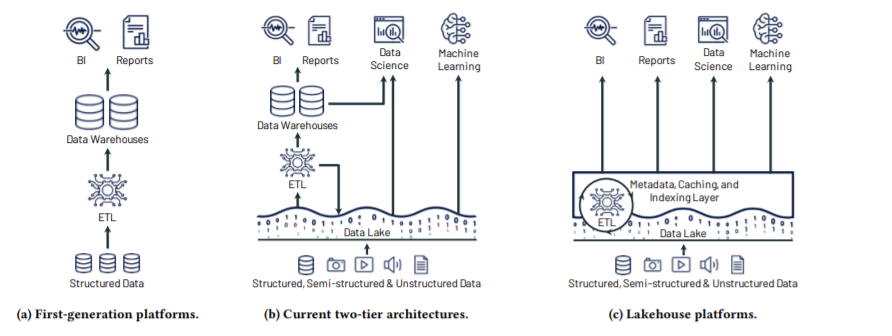

* LakeHouse
    - We define a Lakehouse as a data management system based on lowcost and directly-accessible storage that also provides traditional analytical DBMS management and performance features such as ACID transactions, data versioning, auditing, indexing, caching, and query optimization. Lakehouses thus combine the key benefits of data lakes and data warehouses: low-cost storage in an open format accessible by a variety of systems from the former, and powerful management and optimization features from the latter. The key question is whether one can combine these benefits in an effective way: in particular, Lakehouses’ support for direct access means that they give up some aspects of data independence, which has been a cornerstone of relational DBMS design

* Two-tier data lake + warehouse architecture downsides:
    - Reliability
        - Keeping the data lake and warehouse consistent is
    difficult and costly. Continuous engineering is required to ETL data
    between the two systems and make it available to high-performance
    decision support and BI. Each ETL step also risks incurring failures
    or introducing bugs that reduce data quality, e.g., due to subtle
    differences between the data lake and warehouse engines.
    - Data staleness
        - The data in the warehouse is stale compared to
    that of the data lake, with new data frequently taking days to load.
    This is a step back compared to the first generation of analytics
    systems, where new operational data was immediately available for
    queries
    - Limited support for advanced analytics
    - Total cost of ownership

  
- References:
    - https://databricks.com/wp-content/uploads/2020/12/cidr_lakehouse.pdf#:~:text=Lakehouse:%20A%20New%20Generation%20of%20Open%20Platforms%20that,designed,%20which%20could%20be%20eliminated%20with%20a%20Lakehouse
