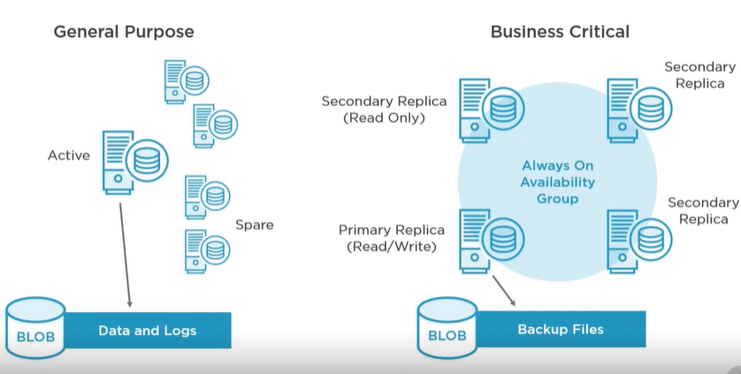
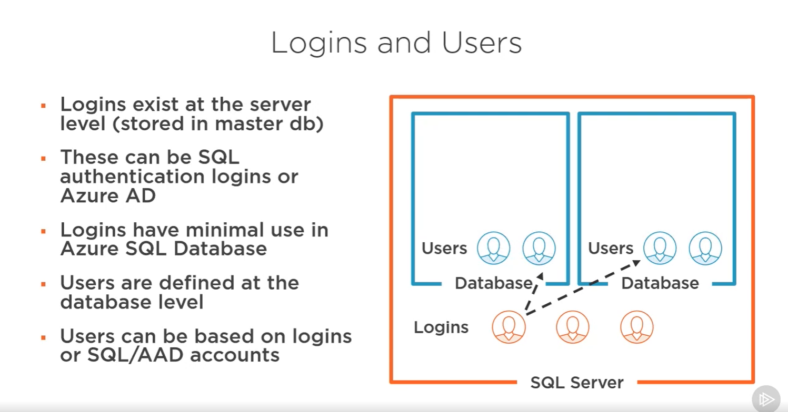
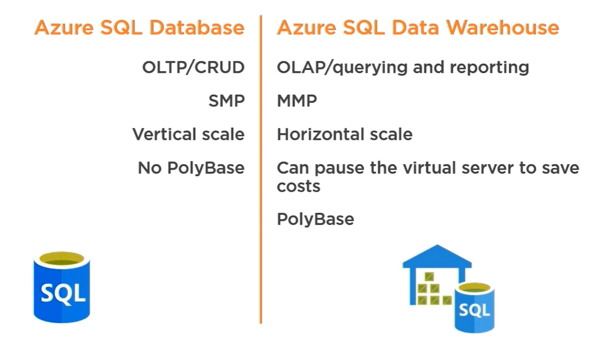

## Azure SQL Database


* ***Resource purchasing models***:
    - ***DTU*** (Database transaction unit):
        - guarantees a certain level of compute, storage, and I/O resources
    - ***VCore*** (recomended):
        - gives the option to choose between generations of hardware, number of cores, memory, and storage size 

* ***Service tiers***:
    - ***Standart (General purpose)*** - is disigned for most generic workloads, 99.99% SLA, 5-10ms storage latency
    - ***Premium (Business critical)*** - for apps requiring low latency, 99.99% SLA, 1-2ms storage latency 
        - In-memory OLTP storage

    - ***Hyperscale*** - is primarily intended for customers who have large dbs, up to 100TB (vcore only)
* ***Deployment options***:
    - ***Single database*** - isolated db that is perfect for applications that need a single data source
        - Each db with its own guaranteed compute, memory, and storage
        - Each db is isolated from each other and is managed via a SQL Database server (logical server)
    - ***Elastic pool*** - collection of single dbs with a shared set of resources such as CPU or memory 
        - Cost-effective solution for managing and scaling multiple dbs that have varying and inpredictable usage demands
        - The dbs are on a single Azure SQL Db server and share a set number of resources at a set price
        - Prevent over-provisioning or under-provisioning of resources
    - ***Managed instance*** - a set of dbs that can be used together, easy migration of on-premises dbs
        - Providing a native vitual network implementation
        - Near 100% compativility with the latest SQL Server on-prem
        - Each instance has its guaranteed resources
        - SSIS support via ADF or Azure Database Migration Service
        - Migration Options:
            - Back up and restore:
                - Backups stored in Azure blob can be restore into a managed instance using the T-SQL RESTORE command
            - Data Migration Service:
                - A fully managed service enavling easy migration from SQL Server dbs tp Azure Data platform
        - Single-tenant env with dedicated underlying infrastructure
        - TLS 1.2
        - SQL Agent Jobs available
* ***Security***:
    - ***Network security***:
        - ***IP firewall rules***:
            - Grand access to dbs based on the originating IP address of each request
        - ***VNet firewall rules***:
            - Enable azure sql db to only accept requests originated from subnets inside a vNet
        - ***Private Endpoints***
    - ***Access management***:
        - ***SQL authentication***:
            - Using DB username and password
        - ***Azure AD authentication***:
            - Using identities in AAD
        - ***Row-level security***:
            - Control access to rows ib a table based on the role of the user
    - ***Threat protection***:
        - ***Auditing in Azure Monitor logs and Event Hubs***:
            - Tracking db activities and helps maintaining compliance with security standards
        - ***Advanced Thread Protection***:
            - Analyzes your SQL Server logs to detect unusual behavior and potentially harmful attemps
    - ***Information protection and encryption***:
        - ***Transport Layer Security (TLS)***: Always enforces encryption for all connections
        - ***Transparent Data Encryption***: Protects data at rest from offline access to raw files or backups
            -  encrypts SQL Server, Azure SQL Database, and Azure Synapse Analytics data files. This encryption is known as encrypting data at rest.
            - It performs real-time encryption and decryption of the database, associated backups, and transaction log files at rest without requiring changes to the application.
            ```sql
            USE master;
            GO
            CREATE MASTER KEY ENCRYPTION BY PASSWORD = '<UseStrongPasswordHere>';
            go
            CREATE CERTIFICATE MyServerCert WITH SUBJECT = 'My DEK Certificate';
            go
            USE AdventureWorks2012;
            GO
            CREATE DATABASE ENCRYPTION KEY
            WITH ALGORITHM = AES_128
            ENCRYPTION BY SERVER CERTIFICATE MyServerCert;
            GO
            ALTER DATABASE AdventureWorks2012
            SET ENCRYPTION ON;
            GO```
        - ***Dynamic data masking***: Protects sensitive data by masking it for non-privileged users
        - ***Always Encrypted***: Protects data from high privileged, unauthorized users
        - ***Key management***: Allows customers to take ownership of key management using AKV
* ***Backups***:
    - Stored in paired region
    - Azure SQL DB automatically creates the db backups that kept between 7 and 35 days
    - Types:
        - *Full backup*: Backs up the whole db
            - Every weel
        - *Differential backup:* Captures only the data that has changed since the last full backup 
            - every 12 hours
        - *Transaction log backup*:  Records of all the committed and uncommitted trans
            - every 5-10 minutes
    - Backup files are copied to RA-GRS Standard blob storage by default
    - Backups are automatically encrypred at rest via TDE
    - Retention Periond Types:
        - Point in time (7-35 days)
        - Long-term retention (up to 10 years)
            - only full backups
    - Restore options:
        - Restore an existing db to a point-in-time in the past
        - Restore a deleted db to the time it was deleted
        - Restore a db to another geo location
        - Resore a db from a specific long-term backup
    - After deleting a logical server dbs could not be restored (you can just use long term backups)
* ***Import/Export***:
    - BACPAC - contaions the db schema and data
    - copy db to blob storage
* ***Geo-Replication***:
    - SQL Server -  single master db
    - Up to 4 read-only replicas can be added as secondary dbs
    - Your can create replicas of replicas of needed
    - Apps can be configured to use local replicas for read operations
    - Failover is manually initiated
    - Auto-failover groups can be used to group dbs for failover operations and automate failover 
* ***Elastic DB Job***:
    - Is a native Azure SQL DB service that executes custom jobs on onr pr many Azure SQL DBs in an interval
    - Targets different SQL DB servers, subs, and regions
    - Supports T-SQL or Powershell creation
    - Provide the ability to run one or more T-SQL scripts in parallel, across many dbs, on a schedule or on-demand
    - Single and pooled dbs, SQL Server and shardmap are supported
    - Servers and pools are enumerated at runtime, so jobs run against dbs that exists at the time of execution 

* ***SQL Data Sync***:

    - Is an Azure SQL db service that lets you synchronize the data bi-directionally across multiple SQL dbs and SQL Servers instances
    - Main Cases:
        - Hybrid data sync
        - Distribured apps
        - Globally distributed apps

* ***Dynamic data masking***:
    - Dynamic data masking helps prevent unauthorized access to sensitive data by enabling customers to designate how much of the sensitive data to reveal with minimal impact on the application layer. It’s a policy-based security feature that hides the sensitive data in the result set of a query over designated database fields, while the data in the database is not changed.
    - Dynamic data masking can be configured by the Azure SQL Database admin, server admin, or SQL Security Manager roles.
    - Dynamic data masking policy:
        - *SQL users excluded from masking* - A set of SQL users or Azure AD identities that get unmasked data in the SQL query results
        - *Masking rules* - A set of rules that define the designated fields to be masked and the masking function that is used. 
        - *Masking functions* - A set of methods that control the exposure of data for different scenarios.
    - Masking funcs:
        - Default - Full masking according to the data types of the designated fields:
            - Use XXXX  for strings
            - Use a zero value for numeric data types
            - Use 01-01-1900 for date/time data types 
            - For XML the document <masked/> is used.
            - Use an empty value for special data types
        - Credit card - Masking method, which exposes the last four digits of the designated fields (XXXX-XXXX-XXXX-1234)
        - Email - Masking method, which exposes the first letter and replaces the domain with XXX.com (aXX@XXXX.com)
        - Random number - Masking method, which generates a random number according to the selected boundaries and actual data types.
        - Custom text - Masking method, which exposes the first and last characters (prefix[padding]suffix)
    - MASKED WITH (FUNCTION = '<default() | partial(1, 'XXX', '1')>')
* ***Data Discovery & Classification***
    - Serve as infrastructure for:
        - Helping to meet standards for data privacy and requirements for regulatory compliance.
        - Various security scenarios, such as monitoring (auditing) and alerting on anomalous access to sensitive data.
        - Controlling access to and hardening the security of databases that contain highly sensitive data.
* ***Securing Access***:  
    - GRAND/REVOKE/DENY permissions model
    - There are no server rolses for Azure SQL DB
    - Managed instances does have server roles
    - There are two special db roles in the master db for Azure SQL DB:
        - dbmanager - Create, delete and manage dbs
        - loginmanager - Can create, delete and manage logins


