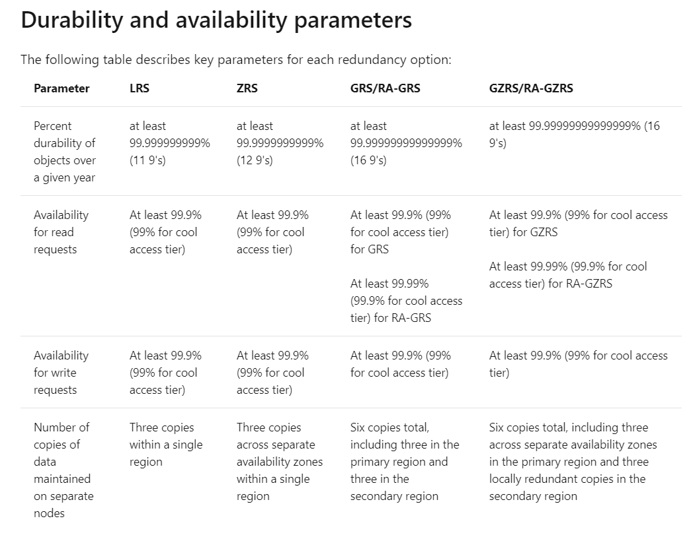

* Storage Account - logical container

* Types of storage accounts:
    - Standard
        - General-purpose v2
            - Blob, File, Queue, Table, and Data Lake Storage
            - LRS/GRS/RA-GRS  ZRS/GZRS/RA-GZRS2
            - Basic storage account type for blobs, files, queues, and tables. Recommended for most scenarios using Azure Storage.
    - Premium
        - Block blobs
            - Block blobs only
            - LRS ZRS
            - Storage accounts with premium performance characteristics for block blobs and append blobs. Recommended for scenarios with high transactions rates, or scenarios that use smaller objects or require consistently low storage latency.
        - File shares
            - File shares only
            - LRS ZRS
            - Files-only storage accounts with premium performance characteristics. Recommended for enterprise or high performance scale applications.
        - Page blobs
            - Page blobs only
            - LRS
            - Premium storage account type for page blobs only.

* Storage Services
    - Blob storage
        - https://<storage-account>.blob.core.windows.net
    - Data Lake Storage Gen2
        - https://<storage-account>.dls.core.windows.net
    - Azure Files
        - https://<storage-account>.file.core.windows.net
        - Azure Files offers fully managed file shares in the cloud that are accessible via the industry standard Server Message Block (SMB) protocol or Network File System (NFS) protocol. Azure file shares can be mounted concurrently by cloud or on-premises deployments. Azure Files SMB file shares are accessible from Windows, Linux, and macOS clients. Azure Files NFS file shares are accessible from Linux or macOS clients. Additionally, Azure Files SMB file shares can be cached on Windows Servers with Azure File Sync for fast access near where the data is being used.
    - Queue storage
        - https://<storage-account>.queue.core.windows.net
        - Azure Queue Storage is a service for storing large numbers of messages. You access messages from anywhere in the world via authenticated calls using HTTP or HTTPS. A queue message can be up to 64 KB in size. A queue may contain millions of messages, up to the total capacity limit of a storage account. Before version 2017-07-29, the maximum time-to-live allowed is seven days. For version 2017-07-29 or later, the maximum time-to-live can be any positive number, or -1 indicating that the message doesn't expire. If this parameter is omitted, the default time-to-live is seven days. 
    - Table storage
        - https://<storage-account>.table.core.windows.net
        - Azure Table storage stores large amounts of structured data. The service is a NoSQL datastore which accepts authenticated calls from inside and outside the Azure cloud. Azure tables are ideal for storing structured, non-relational data. 
            - Entity: An entity is a set of properties, similar to a database row. An entity in Azure Storage can be up to 1MB in size. An entity in Azure Cosmos DB can be up to 2MB in size.
            - Properties: A property is a name-value pair. Each entity can include up to 252 properties to store data. Each entity also has three system properties that specify a partition key, a row key, and a timestamp. Entities with the same partition key can be queried more quickly, and inserted/updated in atomic operations. An entity's row key is its unique identifier within a partition.

* Redundancy Options

* Blob Types
    - Azure Storage supports three types of blobs:
        - Block blobs 
            - store text and binary data. Block blobs are made up of blocks of data that can be managed individually. Block blobs store up to about 4.75 TiB of data. Larger block blobs are available in preview, up to about 190.7 TiB
        - Append blobs
            - are made up of blocks like block blobs, but are optimized for append operations. Append blobs are ideal for scenarios such as logging data from virtual machines.
        - Page blobs 
            - store random access files up to 8 TB in size. Page blobs store virtual hard drive (VHD) files and serve as disks for Azure virtual machines.

* Role assignment
    - Roles:
        - Storage Blob Data Owner 
            - Use to set ownership and manage POSIX access control for Azure Data Lake Storage Gen2. For more information, see Access control in Azure Data Lake Storage Gen2.
        - Storage Blob Data Contributor 
            -Use to grant read/write/delete permissions to Blob storage resources.
        - Storage Blob Data Reader 
            - Use to grant read-only permissions to Blob storage resources.   
        - Storage Blob Delegator    
            - Get a user delegation key to use to create a shared access signature that is signed with Azure AD credentials for a container or blob.
    - Scopes:
        - An individual container. 
            - At this scope, a role assignment applies to all of the blobs in the container, as well as container properties and metadata.
        - An individual queue. 
            - At this scope, a role assignment applies to messages in the queue, as well as queue properties and metadata.
        - The storage account
            - At this scope, a role assignment applies to all containers and their blobs, or to all queues and their messages.
        - The resource group. 
            - At this scope, a role assignment applies to all of the containers or queues in all of the storage accounts in the resource group.
        - The subscription. 
            - At this scope, a role assignment applies to all of the containers or queues in all of the storage accounts in all of the resource groups in the subscription.
        - A management group. 
            - At this scope, a role assignment applies to all of the containers or queues in all of the storage accounts in all of the resource groups in all of the subscriptions in the management group

* Data Protection:
    - Soft delete for containers (preview)
        - Soft delete for containers (preview) protects your data from being accidentally or maliciously deleted. When container soft delete is enabled for a storage account, a deleted container and its contents are retained in Azure Storage for the period that you specify. During the retention period, you can restore previously deleted containers. Restoring a container restores any blobs within that container when it was deleted.
    - Blob Versioning
        - You can enable Blob storage versioning to automatically maintain previous versions of an object. When blob versioning is enabled, you can restore an earlier version of a blob to recover your data if it is erroneously modified or deleted.
        - Not yet supported in DLakeG2
    - Soft delete for blobs
        - Blob soft delete protects an individual blob, snapshot, or version from accidental deletes or overwrites by maintaining the deleted data in the system for a specified period of time. During the retention period, you can restore a soft-deleted object to its state at the time it was deleted. After the retention period has expired, the object is permanently deleted.
    - Change feed 
        - The purpose of the change feed is to provide transaction logs of all the changes that occur to the blobs and the blob metadata in your storage account. The change feed provides ordered, guaranteed, durable, immutable, read-only log of these changes.
    - Point-in-time restore for block blobs
        - Point-in-time restore provides protection against accidental deletion or corruption by enabling you to restore block blob data to an earlier state. Point-in-time restore is useful in scenarios where a user or application accidentally deletes data or where an application error corrupts data. Point-in-time restore also enables testing scenarios that require reverting a data set to a known state before running further tests.
        - Point-in-time restore requires that the following Azure Storage features be enabled before you can enable point-in-time restore:
            - Soft delete
            - Change feed
            - Blob versioning
    - Immutable storage for Azure Blob storage enables users to store business-critical data objects in a WORM (Write Once, Read Many) state. This state makes the data non-erasable and non-modifiable for a user-specified interval.
        - Not yet supported in DLakeG2

* Public Access Level:
    - No public read access: 
        - The container and its blobs can be accessed only with an authorized request. This option is the default for all new containers.
    - Public read access for blobs only: 
        - Blobs within the container can be read by anonymous request, but container data is not available anonymously. Anonymous clients cannot enumerate the blobs within the container.
    Public read access for container and its blobs: 
        - Container and blob data can be read by anonymous request, except for container permission settings and container metadata. Clients can enumerate blobs within the container by anonymous request, but cannot enumerate containers within the storage account. 

* Security:
    - Data is incrypted in transit
        - Configure the minimum required version of Transport Layer Security (TLS) for a storage account.
        - Enable the Secure transfer required option on all of your storage accounts (HTTPS)
    - Data is encrypted at rest
        - Customers who require high levels of assurance that their data is secure can also enable 256-bit AES encryption at the Azure Storage infrastructure level. When infrastructure encryption is enabled, data in a storage account is encrypted twice — once at the service level and once at the infrastructure level — with two different encryption algorithms and two different key
        - You can specify a customer-managed key to use for encrypting and decrypting data in Blob storage and in Azure Files.1,2 Customer-managed keys must be stored in Azure Key Vault or Azure Key Vault Managed Hardware Security Model (HSM) 
        - Encryption scopes enable you to manage encryption with a key that is scoped to a container or an individual blob. You can use encryption scopes to create secure boundaries between data that resides in the same storage account but belongs to different customers.

* Data Lake Gen2:
    - Data Lake Storage Gen2 supports the following authorization mechanisms:
        - Shared Key authorization
        - Shared access signature (SAS) authorization
            -  SAS is a URI that grants restricted access rights to Azure Storage resources. You can provide a shared access signature to clients who should not be trusted with your storage account key but to whom you wish to delegate access to certain storage account resources. By distributing a shared access signature URI to these clients, you can grant them access to a resource for a specified period of time, with a specified set of permissions.
            - Types:
                - Service SAS:
                    - Provides access to a specific resource in one of the storage services 
                - Account SAS:
                    - Provides access to one of more storage services
                    - Specific operations can be granted fot the sevice and rights for service content
                - Both types have certain common parameters and signed by an account key
            - Forms of SAS:
                - Ad hoc SAS:
                    - The parameters are specified as part of the SAS creation and are part of the SAS URI
                - SAS using stored access policy:
                    - SAS is created from  a stored access policy that defines many of the constraits
                    - Only service type
                - Role-based access control (Azure RBAC)
        - Access control lists (ACL)
            - Types:
                - Access ACLs
                    - Access ACLs control access to an object. Files and directories both have access ACLs.
                - Default ACLs
                    - Default ACLs are templates of ACLs associated with a directory that determine the access ACLs for any child items that are created under that directory. Files do not have default ACLs.
            - The permissions on directories and files in a container, are Read, Write, and Execute, and they can be used on files and directories
            - If you are granting permissions by using only ACLs (no Azure RBAC), then to grant a security principal read or write access to a file, you'll need to give the security principal Execute permissions to the root folder of the container, and to each folder in the hierarchy of folders that lead to the file.
            - In the POSIX-style model that's used by Data Lake Storage Gen2, permissions for an item are stored on the item itself. In other words, permissions for an item cannot be inherited from the parent items if the permissions are set after the child item has already been created. Permissions are only inherited if default permissions have been set on the parent items before the child items have been created.
            - RBAC has a priority on ACLs