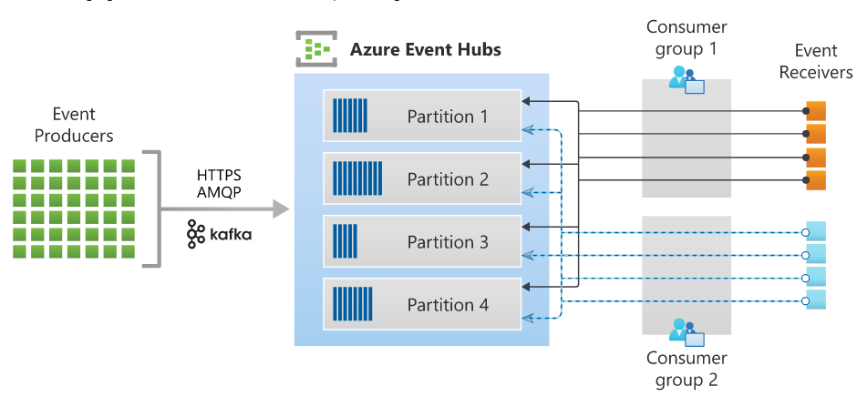

## ***Compare messaging services***
* Event vs. message services
    - Event
        - An event is a lightweight notification of a condition or a state change. 
        - The publisher of the event has no expectation about how the event is handled. 
        - The consumer of the event decides what to do with the notification.
    - Message
        - A message is raw data produced by a service to be consumed or stored elsewhere. The message contains the data that triggered the message pipeline. 
        - The publisher of the message has an expectation about how the consumer handles the message. 
        - A contract exists between the two sides. For example, the publisher sends a message with the raw data, and expects the consumer to create a file from that data and send a response when the work is done.
* Comparison of services
    - Event Grid	
        - Reactive programming	
        - Event distribution (discrete)	
        - React to status changes
    - Event Hubs	
        - Big data pipeline	
        - Event streaming (series)	
        - Telemetry and distributed data streaming
    - Service Bus	
        - High-value enterprise messaging	
        - Message	
        - Order processing and financial transactions

## ***Azure Event Hub***
* Azure Event Hubs is a big data streaming platform and event ingestion service. It can receive and process millions of events per second. Data sent to an event hub can be transformed and stored by using any real-time analytics provider or batching/storage adapters.
* Key architecture components:
    - Event Producer
        - Any entity that sends data to an event hub. Event publishers can publish events using HTTPS or AMQP 1.0 or Apache Kafka (1.0 and above)
    - Partions
        - Each consumer only reads a specific subset, or partition, of the message stream.
        - The number of partitions is specified at creation and must be between 1 and 32 in Event Hubs Standard. The partition count can be up to 2000 partitions per Capacity Unit in Event Hubs Dedicated.
    - Consumer groups
        - A view (state, position, or offset) of an entire event hub. Consumer groups enable consuming applications to each have a separate view of the event stream. They read the stream independently at their own pace and with their own offsets.
    - Throughput units
        - Pre-purchased units of capacity that control the throughput capacity of Event Hubs.
    - Event receivers
        - Any entity that reads event data from an event hub. All Event Hubs consumers connect via the AMQP 1.0 session. The Event Hubs service delivers events through a session as they become available. All Kafka consumers connect via the Kafka protocol 1.0 and later.
    -  
* SAS Tokens
    - Event Hubs uses Shared Access Signatures, which are available at the namespace and event hub level. A SAS token is generated from a SAS key and is an SHA hash of a URL, encoded in a specific format.
* Stream offsets
    - An offset is the position of an event within a partition. You can think of an offset as a client-side cursor. 
    - he offset is a byte numbering of the event. This offset enables an event consumer (reader) to specify a point in the event stream from which they want to begin reading events. 
    - You can specify the offset as a timestamp or as an offset value
    - Consumers are responsible for storing their own offset values outside of the Event Hubs service.
    - Within a partition, each event includes an offset.
    - Checkpointing is a process by which readers mark or commit their position within a partition event sequence. Checkpointing is the responsibility of the consumer and occurs on a per-partition basis within a consumer group. This responsibility means that for each consumer group, each partition reader must keep track of its current position in the event stream, and can inform the service when it considers the data stream complete.
* Capture
    - Azure Event Hubs enables you to automatically capture the streaming data in Event Hubs in an Azure Blob storage or Azure Data Lake Storage Gen 1 or Gen 2 account of your choice, with the added flexibility of specifying a time or size interval
    - Saves events in Avro format
* Auto-inflate 
    - Auto-scaling feature

## ***Azure Stream Analytics***

* *Azure Stream Analytics* is a real-time analytics and complex event-processing engine that is designed to analyze and process high volumes of fast streaming data from multiple sources simultaneously.
* *Azure Stream Analytics Cluster* offers a single-tenant deployment for complex and demanding streaming scenarios. At full scale, Stream Analytics clusters can process more than 200 MB/second in real time. Stream Analytics jobs running on dedicated clusters can leverage all the features in the Standard offering and includes support for private link connectivity to your inputs and outputs.
* ***Data stream*** - is an ongoing sequence of events over time
 

* ***Inputs***:
    - Stream Analytics has first-class integration with four kinds of resources as inputs:
        - Azure Event Hubs
        - Azure IoT Hub
        - Azure Blob storage
        - Azure Data Lake Storage Gen2
    - * ***Input Categories***:
        - ***Data stream input*** 
            - any data stream which you need to process in real-time and act upon
            -  Stream Analytics jobs must include at least one data stream input.
        - ***Reference data input***
            - Data which does not change or changes very slowly, such as metadata lookups
            - Storage Account, Azure SQL Database
    - Stream Analytics supports compression across all data stream input sources. Supported compression types are: None, GZip, and Deflate compression. Support for compression is not available for reference data.
* ***Outputs***:
    - Stream Analytics supports partitions for all outputs except for Power BI. 
    - Batching window properties:
        - *timeWindow* - The maximum wait time per batch. The default value is 1 minute and the allowed maximum is 2 hours. 
        - sizeWindow - The number of minimum rows per batch. For Parquet, every batch creates a new file. The current default value is 2,000 rows and the allowed maximum is 10,000 rows.
* ***User-defined functions***:
    - Azure Stream Analytics supports the following four function types:
        - JavaScript user-defined functions (UDF.<function name>)
        - JavaScript user-defined aggregates (UDA.<function name>)
        - C# user-defined functions (using Visual Studio) (UDF.<function name>)
            - not all regions
        - Azure Machine Learning (UDF.<function name>)
    - User-defined functions are stateless, and the return value can only be a scalar value. You cannot call out to external REST endpoints from these user-defined functions 
* ***Streaming Units (SUs)***:
    - Streaming Units (SUs) represents the computing resources that are allocated to execute a Stream Analytics job. The higher the number of SUs, the more CPU and memory resources are allocated for your job.
    - It's best to keep the SU metric below 80% to account for occasional spikes. 
* ***Windowing Functions*** (https://docs.microsoft.com/en-us/azure/stream-analytics/stream-analytics-window-functions):
    - There are five kinds of temporal windows to choose from: 
        - ***Tumbling*** 
            - Tumbling window functions are used to segment a data stream into distinct time segments and perform a function against them
            - The key differentiators of a Tumbling window are that they repeat, do not overlap, and an event cannot belong to more than one tumbling window.
            - Tell me the Count of tweets per time zone every 10 seconds
        - ***Hopping***
            - Hopping window functions hop forward in time by a fixed period. It may be easy to think of them as Tumbling windows that can overlap and be emitted more often than the window size. 
            - Events can belong to more than one Hopping window result set. 
            - Every 5 seconds gives me the count of Tweets over the last 10 seconds
        - ***Sliding***
            - Sliding windows, unlike Tumbling or Hopping windows, output events only for points in time when the content of the window actually changes. In other words, when an event enters or exits the window. So, every window has at least one event. 
            - Similar to Hopping windows, events can belong to more than one sliding window.
            - Give me the count of Tweets for all topics which are Tweeted more than 10 times in the last 10 seconds 
        - ***Session*** 
            - Session window functions group events that arrive at similar times, filtering out periods of time where there is no data. It has three main parameters: timeout, maximum duration, and partitioning key (optional).
            - Tell me the count of Tweets that occur within 5 minutes to each other 
        - ***Snapshot***
            - Snapshot windows groups events that have the same timestamp. Unlike other windowing types, which require a specific window function (such as SessionWindow(), you can apply a snapshot window by adding System.Timestamp() to the GROUP BY clause.
            - Give me the count  of tweets with the same topic type that occur at exactly the same time
    - You use the window functions in the GROUP BY clause of the query syntax in your Stream Analytics jobs.
* ***Error policy***:
    - ***Retry*** - When an error occurs, Azure Stream Analytics retries writing the event indefinitely until the write succeeds. There is no timeout for retries. Eventually all subsequent events are blocked from processing by the event that is retrying. This option is the default output error handling policy.
    - ***Drop*** - Azure Stream Analytics will drop any output event that results in a data conversion error. The dropped events cannot be recovered for reprocessing later. All transient errors (for example, network errors) are retried regardless of the output error handling policy configuration.
* ***Time Handling***:
    - Stream Analytics gives users two choices for picking event time:
        - ***Arrival time ***
            - Arrival time is assigned at the input source when the event reaches the source. You can access arrival time by using the EventEnqueuedUtcTime property for Event Hubs input, the IoTHub.EnqueuedTime property for IoT Hub input, and the BlobProperties.LastModified property for blob input.
            - default
        - ***Application time*** (also named Event Time)
            - Application time is assigned when the event is generated, and it's part of the event payload. To process events by application time, use the Timestamp by clause in the SELECT query. If Timestamp by is absent, events are processed by arrival time.

* ***Event Ordering***:
    - late arrival policy
        - Sometimes events arrive late because of various reasons. For example, an event that arrives 40 seconds late will have event time = 00:10:00 and arrival time = 00:10:40. If you set the late arrival policy to 15 seconds, any event that arrives later than 15 seconds will either be dropped (not processed by Stream Analytics) or have their event time adjusted. In the example above, as the event arrived 40 seconds late (more than policy set), its event time will be adjusted to the maximum of late arrival policy 00:10:25 (arrival time - late arrival policy value). Default late arrival policy is 5 seconds.
    - out-of-order policy
        - Event may arrive out of order as well. After event time is adjusted based on late arrival policy, you can also choose to automatically drop or adjust events that are out-of-order. If you set this policy to 8 seconds, any events that arrive out of order but within the 8-second window are reordered by event time. Events that arrive later will be either dropped or adjusted to the maximum out-of-order policy value. Default out-of-order policy is 0 seconds.